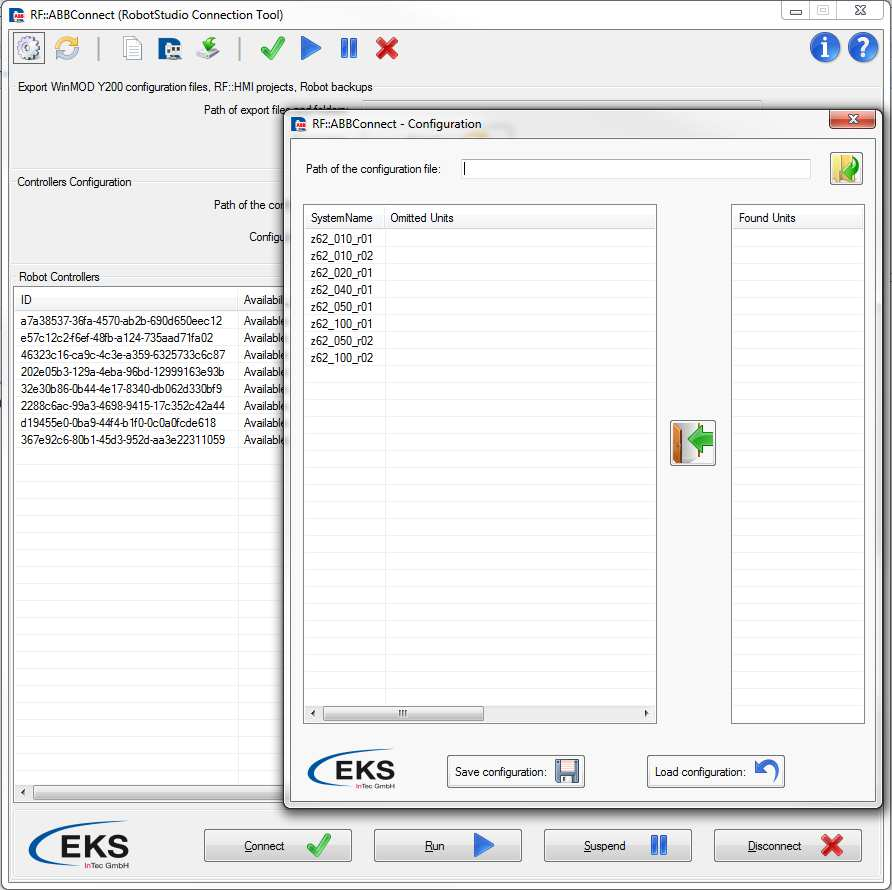
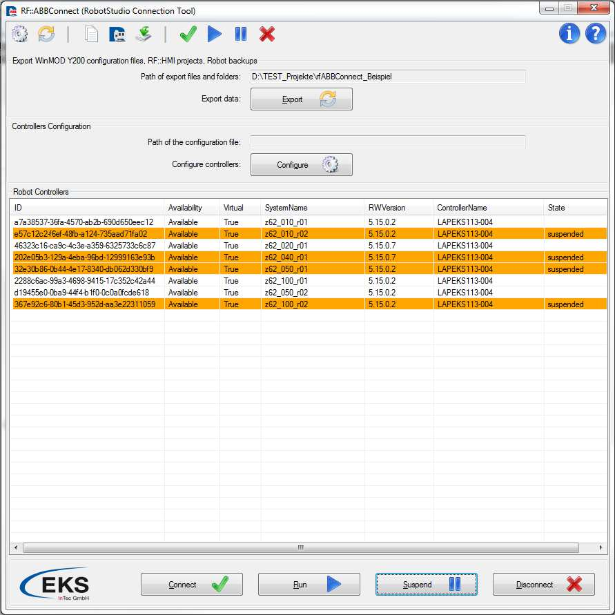
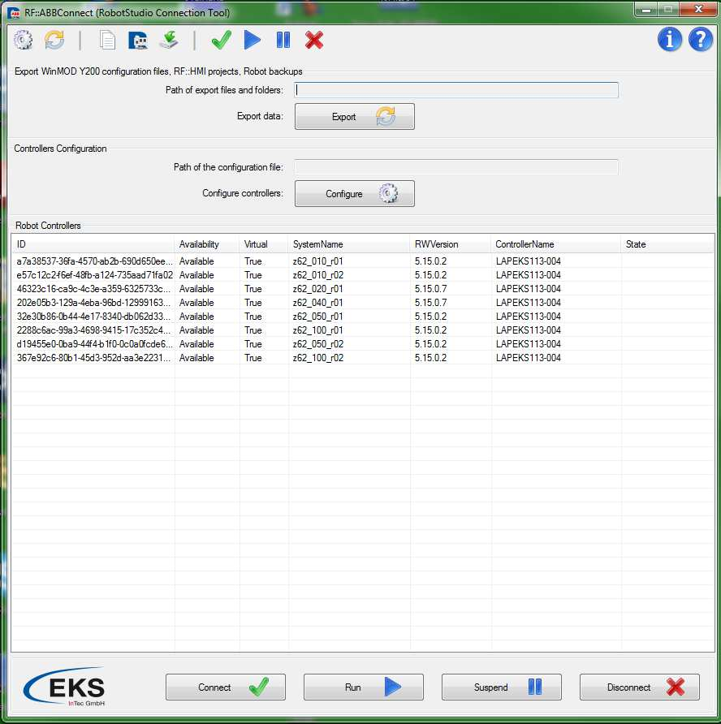

# RF::ABBConnect (RobotStudio Connection Tool)   

## Reference Manual       	

​             																																						  Version: v0.3

​																																					   Release : January, 2015

## 1. Overview

**RF::ABBConnect** represents one software solution for communication between ABB RobotStudio and RF::Suite components, as well as WinMOD software.

**RF::ABBConnect** is completely developed by EKS InTec GmbH in Weingarten, Germany.

**RF::ABBConnect** contains procedures for preparations of the WinMOD Y200 communication interface, but as well is able to prepare RF::HMI project for each robot controller and to export robot controller backup. 

Main aim of **RF::ABBConnect** is to enable signal transfer between RF::Suite components and/or WinMOD software, and ABB RobotStudio during the process of **virtual** **commissioning**, shortens known as VC.

Virtual commissioning represents procedure in which assembly lines in auto industry are tested virtually (using RF::Suite and WinMOD) before real implementation in factory. Next picture represents overview of **RF::ABBConnect**.

## 2. Working with RF::ABBConnect

**Mouse-Keyboard interaction:**

ListView which shows all available and active virtual controllers can be controlled with mouse clicks and keyboard. It is possible to select multiple robot controllers holding down pressed **Ctrl** key and making **single clicks** on robot controllers in list.
It is possible to use some keyboard shortcuts as well, for example combination of keys **Ctrl+A**
selects all robot controllers.
If you press **Alt** key, you can enable keyboard interaction feature so that you can execute button clicks with keyboard tasters instead of mouse clicks. If you look at next picture you can see that for each button one of the letters is underlined (ex. Connect). The underlined letter has to be pressed in combination with **Alt** key in order to execute button clicks from keyboard tasters instead of mouse clicks. So in case that you want to connect to some of the selected robot controllers you need to press combination of **Alt+C** keys.

## 3. Configuration Environment

Configuration environment can be started through button, shortcut icon or combination of keyboard keys. If you have a look at the picture above this paragraph, you can see two boxes marked with red color. One of those represents button which starts configuration environment and the other represents shortcut. As well, it is possible to use keyboard keys with the combination of **Alt+G** keys.
Blue box represents display of the path for the configuration file and cannot be edited through main window, but only directly inside of the configuration environment window.

After you have successfully started configuration environment, pop up window appears. Through this window you can completely configure all found robot controllers.

**Save configuration:**

Please, in order to configure some robot controller, first select robot controller from the column ***SystemName*.** As soon as you have done this, at the right side under ***Found Units*** you will get list of all found input / output hardware units of the robot controller. Now you have a possibility to select those which you wish to exclude from the communication interface, simply holding Ctrl button and selecting single units by making left mouse button single clicks. Instead if you wish to exclude all of them you can use **Ctrl+A** keys combination.

When you have chosen hardware units which you wish to exclude, simply press button which is found between two list views in order to mark selected units as excluded. Pressing this button your excluded unit names will appear under Omitted Units column. This means that those units will be excluded from communication interface and therefore from all generated configuration files, RF::HMI project and so on.

If you have done successfully complete procedure, it should look somehow as on the picture above where two hardware units (WeldTimmerPIO, WeldTimer1) are excluded from communication interface of z62_010_r01 robot controller.
After you have configured all robot controllers, please press **Save configuration** button or  **Alt+S** keys combination in order to start save file dialog box. Through this box you can specify file path and file name of the configuration file.
**Note:** Configuration file must be saved in XML format in order to be valid.

**Load configuration:**

At the top of the configuration window there is a text box through which you can give in absolute path of the configuration file. It is a recommendation to use browse button next to the text box in order to prevent wrong file path inputs by typing. Be aware of the fact that only after you have successfully chosen path of the configuration file you can press on **Load** **configuration** button or use **Alt+L** keys combination in order to import robot controllers’ configuration from the file. If you have closed configuration environment window and you are not sure how your robot controllers are configured, simply start again configuration environment window and automatically all fields will be filled in with actual configuration. Path of your actual configuration file is always showed in main window in a display text box which represents path of the configuration file (box which was marked with light blue color at some of the previous pages in this manual).

> **Note**: Even if you have just saved configuration file, you need to load configuration from this file as robot controllers are configured only in case that you have chosen path of the configuration file and the pressed Load configuration button or Alt+L keys combination. Shortly, when you configure robot controllers and save configuration file, robot controllers are not automatically configured with this configuration template until you load this file successfully.

## 4. Chose a path

If you are going to create WinMOD Y200 signal lists, RF::HMI projects and corresponding files, or Archive robot Backups, than firstly select all robot controllers from main window for which you wish to export files. After you have selected some of them holding Ctrl button and selecting robot controller entries by single left button mouse clicks or by using Ctr+A keys combination, please start export environment window using some of several ways which are explained in the next paragraph.

Export environment can be started through button, shortcut icon or combination of keyboard keys. If you have a look at the picture above this paragraph, you can see two boxes marked with red color. One of those represents button which starts export environment and the other represents shortcut icon. As well it is possible to use keyboard keys with the combination of **Alt+E** keys.

Blue box represents display of the path for the export folder and cannot be edited through main window, but only directly inside of the export environment window.

From dialog menu which automatically comes on to the center of your screen, you need to refer to the path at which you want to store all generated files. At the top of the export window there is a text box through which you can give in absolute path of the export folder. It is a recommendation to use browse button next to the text box in order to prevent wrong folder path inputs by typing.

> **Note**: Given path is used for all generated files; WinMOD Y200 signal lists, as well as for RF::HMI projects with necessary text files, and Archive robot controller backups.

## 5. Creating WinMOD Y200 list, HMI project or Archive backups

If you have already chosen path where all generated files are going to be stored, then you can chose to generate WinMOD Y200 signal lists for all selected robot controllers, to create RF::HMI projects with corresponding text files, or to create archive robot controllers backups. 

You can call one of those three options on all selected robot controllers, using **Config** **(WinMOD Y200)**, **HMI (projects)**, or **Archive (Backups)** buttons. As well you can call any of three procedures directly from keyboard if you use **Alt+W, Alt+H** or **Alt+B** combinations of keyboard tasters.

As soon as you have called one of the procedures, dialog menu appears. From this dialog menu it is necessary to make a single click on OK button or to confirm executution with ENTER keyboard taster. This example is based on option which creates WinMOD Y200 signal lists and is completely same as the procedure of RF::HMI projects creating, or Archive backups creation, that because the other options will not be separately explained.

> **Note**: In order to create WinMOD Y200 signal lists, RF::HMI projects and corresponding text files or Archive robot controller backup you do not have to be connected to robot controllers, so it means you can execute any of these three options with no need to select any of four interaction buttons.

After the procedure is completely executed you will be informed with new dialog menu which explicitly says where exactly RF::ABBConnect has created all generated files. During the process of execution you will be informed with progress bar dialog about actual status of execution. During the execution of robot controller backup creation, no progress bar dialog will be shown as this procedure longs very shortly and progress bar dialog is completely unnecessary. In any case as soon as execution is finished you will be informed through dialog menu about all robot controllers’ backups which are successfully created and at the same time about all controllers for which backups were not successfully created. Under path which you have selected, generated files are classified in specific folders which are automatically created. If you have chosen option WinMOD Y200 then you can find all generated files inside Infos and Y200_Config folders. For the option HMI project all files are classified to the HMI_Project folder. If you have selected Archive (Backups) button or shortcut, robot controllers’ backups are always classified to the Archive_Backups folder. In Infos folder you can find some useful information about each I/O unit, but those data are only stored as information and are not necessary for virtual commissioning. In Y200_Config folder you can find Y200 signal lists of robot controllers. If you open HMI_Project folder, then you can find RF::HMI project and corresponding text files of robot controllers saved in separate subfolders which are named as controller’s system name. Inside Archive_Backups folder you can find one subfolder for each robot controller. All generated backups of robot controllers are stored in those subfolders, named with the names which contain exact date and time when the robot backup was created.

## 6. Button Interaction

If you finally want to connect to robot controllers and start communication interface, then you need to select wanted robot controllers and to press one of four interaction buttons, depending on what you would like to execute. It is very important to remember the correct order in which buttons need to be pressed if you want to start communication interface correctly and without causing any application errors. So first of all you need to connect to selected robot controllers.

***Connect***

This option you can execute if you select Connect button, shortcut or from keyboard with combination of Alt+C tasters. This option connects RF::ABBConnect application to selected robot controllers but still does not start communication interface.

***Run:***

This option you can execute if you select **Run** button or from keyboard with combination of **Alt+R** tasters. It is important to note that you can only chose **Run** option for selected robot controllers which are already connected (have status connected). This option starts communication interface of all selected and already connected robot controllers.

***Suspend:***

This option you can execute if you select **Suspend** button or from keyboard with combination of **Alt+S** tasters. It is important to note that you can only chose **Suspend** option for selected robot controllers which are already running (have status running). If you chose Suspend option for robot controller which is connected but not running you can cause application to throw error message. This option stops started communication interfaces of selected robot controllers.

***Disconnect:***

This option you can execute if you select Disconnect button or from keyboard with combination of **Alt+D** tasters. It is important to note that you can only chose Disconnect option for selected robot controllers which are already connected (have status connected) or robot controllers which are connected but currently in status suspended. If you chose Disconnect option for robot controller which is connected and in status running you can cause application to throw error message. It means you first need to suspend all running robot controllers and first then to disconnect them. This option disconnects RF::ABBConnect from selected robot controllers which have been previously connected.

## 7. Shared Memory Images

**RF::ABBConnect** creates and handles for each connected robot controllers which is in state running one separate shared memory image. Name of shared memory image is always same as the system name of the robot controller. You can check system names of robot controllers directly from column **System Name** in **RF::ABBConnect** overview.

Size of shared memory images is always set as 4kByte (4096 bytes). Shared image memory consists of three separate address ranges:

| Robot_Axes        | Output_Adress_Range     | XADW 0 – XADW 92          | 96bytes       |
| ----------------- | ----------------------- | ------------------------- | ------------- |
| **Robot_Outputs** | **Output_Adress_Range** | **XADW 96 – XADW 2044**   | **1952bytes** |
| **Robot_Inputs**  | **Input_Adress_Range**  | **XEDW 2048 – XEDW 4092** | **2048bytes** |

