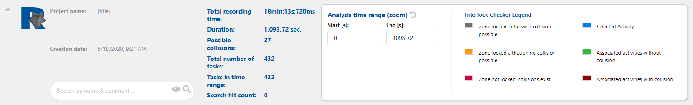

# Interlock Checker

Lorem ipsum dolor sit amet, consetetur sadipscing elitr, sed diam nonumy eirmod tempor invidunt ut labore et dolore magna aliquyam erat, sed diam voluptua. At vero eos et accusam et justo duo dolores et ea rebum. Stet clita kasd gubergren, no sea takimata sanctus est Lorem ipsum dolor sit amet.

## Anzeigenbereich
Der Anzeigenbereich vom Interlock Checker.

<!-- Bei einem ß funktioniert der Verweis nicht -->
### Grosse Informationskopfzeile
In der großen Informationskopfzeile werden Folgende Informationen angezeigt:

- **Project name:**

- **Creation date:**

- **Total recording time:**

- **Duration:**

- **Possible collisions:**

- **Total number of tasks:**
In dem Feld werden die Anzahl der Task angezeigt die in der Rekord Datei vorhandenen sind.

- **Task in time range:**
In dem Feld werden die Anzahl der Task angezeigt die in dem Analysezeitraum liegen. Die Anzahl wird somit durch die Angaben in der "[Analysis time range](#analysis-time-range) (zoom)" beeinflusst. Die maximale Anzahl der Task ist die Anzahl, die in der Rekord Datei vorhandenen Task.

- **Search hit count:**
In dem Feld wird die Anzahl der über das [Suchfeld](#suchfeld) gefundenen Einträge Angezeigt.

### Kleine Informationskopfzeile
In der kleinen Informationskopfzeile sind die [Buttons](#buttons) links in der Buttonspalte und die Kopfzeile zeigt nur die wesendlichen Informationen.

- Search hit count (siehe [Grosse Informationskopfzeile](#grosse-informationskopfzeile)),
- Project name (siehe [Grosse Informationskopfzeile](#grosse-informationskopfzeile)) und
- Creation date (siehe [Grosse Informationskopfzeile](#grosse-informationskopfzeile)).

## Robot Collision Status

## Tabelle
Die Tabelle zeigt die geladenen Elemente mit den Feldern "Name", "# Tasks", "Start [s]", "End [s]", "Duration [s]" und "Comment". Siehe hierzu auch [Einheiten und Bezeichner](#abkürzungen).

