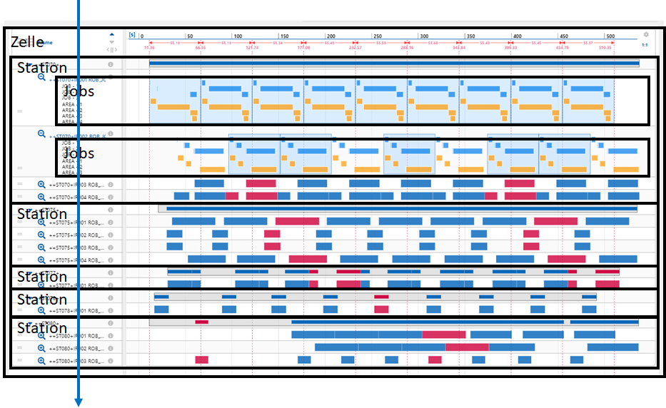

# Begriffserklärung

Die nachfolgenden Begriffe sind zentral für das Verständnis der Darstellungen in RF::SCOUT. Deren Bedeutungen im Kontext von RF::SCOUT wird daher an dieser Stelle vorab beschrieben und definiert.

## Zelle

Eine Zelle besteht aus mehreren Stationen. Sie ist ein abgeschlossener Bereich, in der Bauteile verarbeitet werden. Die Bauteile können aus vorgelagerten Zellen kommen und sie können nach der Verarbeitung an eine nachfolgende Zelle weitergegeben werden.

## Station

Eine Station ist eine Einheit innerhalb der Zelle. Eine Station besteht aus ein oder mehreren Jobs. An einer Station wird eine Bauteil mittels eines oder mehrerer Jobs verarbeitet, bearbeitet, bewegt, etc.

## Job

Ein Job ist die kleinste Einheit in einer Station. Ein Job bearbeitet, verarbeitet, bewegt, etc. ein Bauteil in einer Station.

 <!--rb|rf|dtr 1300 2400-->

## Taktzeit

Die Taktzeit (eng. Cycle Time) wird vom Planer in der Entwurfsphase für eine bestimmte Zelle festgelegt. Sie umfasst alle Schritte, die notwendig sind, um aus einer beliebigen Zahl von Eingangsbauteilen genau ein Endprodukt (in Bezug auf die jeweilige Zelle) zu erzeugen. Das bedeutet im Umkehrschluss, dass unterschiedliche Zellen unterschiedliche Taktzeiten haben können und dass aus deren Verknüpfung die Gesamttaktzeit (Zykluszeit) einer kompletten Anlage resultiert. Letzteres ist nicht Gegenstand dieses Abschnitts.

Die Taktzeit ist somit der Zeitraum, innerhalb dessen im Produktionsprozess Bauteile eine Zelle verlassen und an einem nachgelagerten Zelle desselben Betriebs weiterverarbeitet werden.

Der Takt wird durch ein spezielles Signal ausgezeichnet, das pro Zelle eindeutig festgelegt wird. Dieses Signal wird im Kontext dieser Dokumentation als "Heartbeat" bezeichnet.

## Heartbeat

Der Begriff Herzschlag (eng. Heartbeat) ist ein Synonym für ein gleichmäßiges Arbeitsinkrement. Er wird auch als Rhythmusgeber oder Pitch bezeichnet. Der Herzschlag wird vom Planer, in der Entwurfsphase am Projekt konfiguriert. In "RF::MAX² Analyzer" wird dieser an einer Station festgelegt bzw. konfiguriert (@TODO Verweis). Immer wenn diese Station aktiv ist wird der Herzschlag neu, für den neuen Zyklus, gesetzt. Die Station, die mit dem Herzschlag vom Planer definiert wird, muss nicht die erste oder letzte Station in einer Zelle sein. Der Heartbeat definiert damit die Taktzeit einer kompletten Zelle und nicht die Taktzeit einer einzelnen Station in einer Zelle. Das Heartbeat-Signal wird als rot-gestrichelte, vertikale Line in RF::SCOUT dargestellt. Die Konfiguration ist an anderer Stelle beschrieben (@TODO Verweis).

