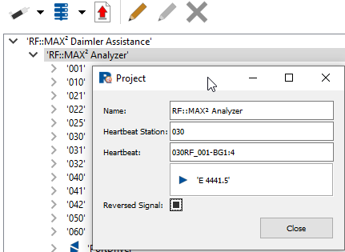
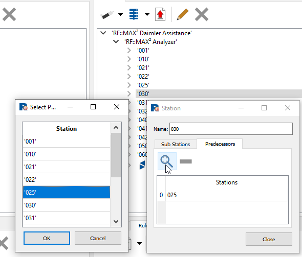
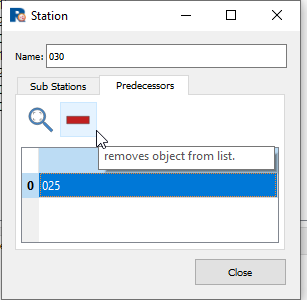

# MAX² - RF::SCOUT Assistenz
MAX² dient der Konfiguration von Aktivitäten über Signale. Eine Aktivität wird über ein Signal oder über ein Signalpaar definiert, die Anfang und Ende einer Aktivität markieren. Dabei werden reguläre Ausdrücke verwendet, um Aktivitäten für mehrere Funktionsgruppen in einer Zeile konfigurieren zu können. Die regulären Ausdrücke werden auf Signalnamen angewendet, die in der Signallist-Datei gelistet sind. Über weitere Konfigurationsoptionen kann eine Aktivität mit zusätzlichen Informationen angereichert werden. Zusätzlich kann ein Signal als sogenanntes Heart-Beat Signal konfiguriert werden, über das der Takt einer Zelle definiert wird. Des Weiteren können Qualitäten konfiguriert werden, wie Belegung von Areas und Kollisionszonen.
Ist die Konfiguration abgeschlossen kann in MAX² der Export eines Konfigurationsfiles angestoßen werden. Dieser File kann in RF::SCOUT hochgeladen werden, um so der CycleTime-App zur Analyse eines Recorderfiles zur Verfügung zu stehen.

## Konfiguration Heartbeat
Ein Signal kann als „Heartbeat“ verwendet werden. Die Konfiguration erfolgt am „Project“ (siehe Abbildung 1). Das Signal muss vom Typ BOOL sein.

_Abbildung 1: Konfiguration des Hartbeat-Signals. Rechtsklick auf Knoten „RF::MAX² Analyzer" öffnet den dargestellten Dialog. Die Zeile Heartbeat Station muss mit der Station konfiguriert werden, aus der das Heartbeat Signal stammt. In Zeile Heartbeat kommt der vollständige Bezeichner des Signals. Mit Drücken der Taste „TAB“ oder anklicken des Buttons „close“ wird die Adresse durch MAX² eingetragen._

## Konfiguration der Abfolge der Stationen
Vor allem in linear aufgebauten Teilen einer Anlage ergibt sich eine logische Abfolge, in der Bauteile bewegt werden. Das oder die Bauteile wandern dabei von Station zu Station. Die Konfiguration erfolgt durch Auswahl einer Station im Abschnitt der Funktionsgruppen via Rechtsklick. Es öffnet sich ein Dialog, über den im Tab „Predecessors“ über eine Klick auf das Lupensymbol eine oder mehrere Stationen als Vorgänger ausgewählt werden können (siehe Abbildung 2).

_Abbildung 2: Konfiguration eines Vorgängers (Predecessor): Rechtsklick auf Station (grau unterlegt im Hintergrund) öffnet sich das rechte Fenster (Vordergrund). Durch Klick auf die Lupe öffnet sich ein weiteres Fenster, aus dem der Vorgänger ausgewählt werden kann._

Ist ein Predecessor zugeordnet und soll dieser entfernt werden, wird im selben Dialog der konfigurierte Predecessor ausgewählt und durch Klick auf das rote Minuszeichen entfernt (siehe Abbildung 3).

_Abbildung 3: Entfernen eines bereits konfigurierten Predecessors durch Auswahl und Klick auf das Minuszeichen_
