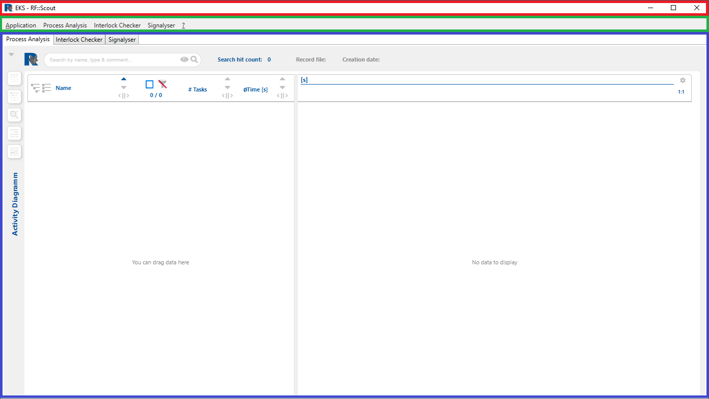
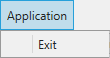
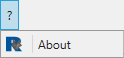
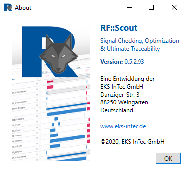
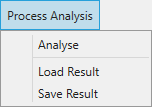
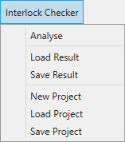
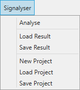
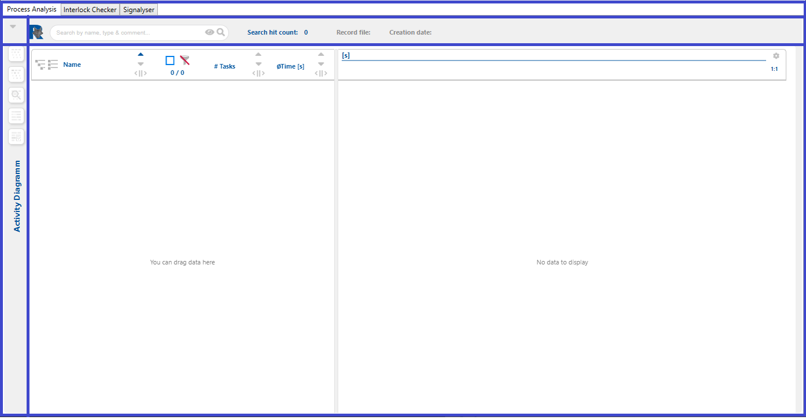
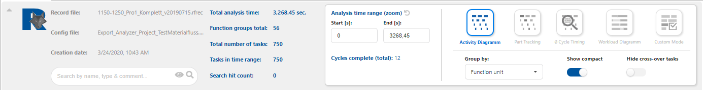
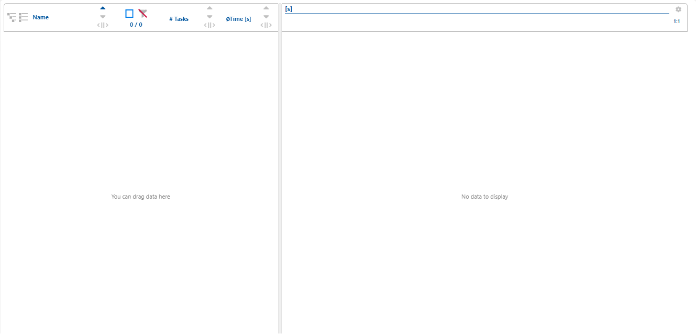

# Oberfläche
Die RF::SCOUT Anwendung unterteilt sich in drei Bereiche,
- Kopfzeile,
- Menüzeile und
- Anzeigenzeile.

## Kopfzeile

Die Kopfzeile ist eine Standardkopfzeil mit links dem Logo, gefolgt von dem Anwendungsnamen und rechte die drei Button Verkleinern, Vollbildschirm und Anwendung Schließen.

## Menüzeile

Der Menübereich besteht aus Application, Process Analysis, Interlock Checker, Signalyser und dem "?".
Über den Menüpunkt Application kann die Anwendung geschlossen werden

und über den Menüpunkt "?"

kann die Aktuelle Version der Anwendung angezeigt werden.

Die weiteren Menüpunkte
- Process Analysis,
- Interlock Checker und
- Signalyser,

Analysieren, Laden und Speichern den Anzeigenbereich (blau) aus bzw. in endspechenden Dateien.

## Anzeigezeile
Der Anzeigenzeile unterteilt sich in fünf Bereiche.

### Tabs
Process Analysis, Interlock Checker und Signalyser.

Diese Tabs verändern die anderen nachfolgenden vier Anzeigenbereiche.
### Kopfinformationsbutton
Der Kopfinformationsbutton besteht aus dem [Wechselicon :fontawesome-solid-caret-right::fontawesome-solid-caret-down:](#caret-right-und-caret-down). Durch drücken wird die Kopfinformation erweitert dargestellt bzw. auf- und zugeklappt.

### Kopfinformationen

#### Kleine Informationskopfzeile
In der kleinen, zugeklappten Informationskopfzeile sind nur die wesendlichen Informationen vorhanden.
Beispielkopfzeile aus der Process Analysis

#### Große Informationskopfzeile
In der großen, aufgekappten Informationskopfzeile sind alle Informationen vorhanden.
Beispiekopfzeile aus der Process Analysis

### Buttonspalte bzw. Optionsbuttonspalte.

### Hauptanzeigenbereich.

