# Signalyser
Die Signalyser App ermöglicht die Auswahl und Konfiguration der Rohsignale, ohne diese in Aktivitäten umzuwandeln. Die Signale werden gemäß ihres Datentyps dargestellt. Dies erlaubt auch die Abbildung von Kurven wie Energieverbrauch.

Startet man die Signalyser App zum ersten Mal, muss man als erstes ein Recorder File auswählen. Dazu klickt man im Hauptmenü auf Signalyser, woraufhin sich der im folgenden Bild gezeigte Dialog öffnet.
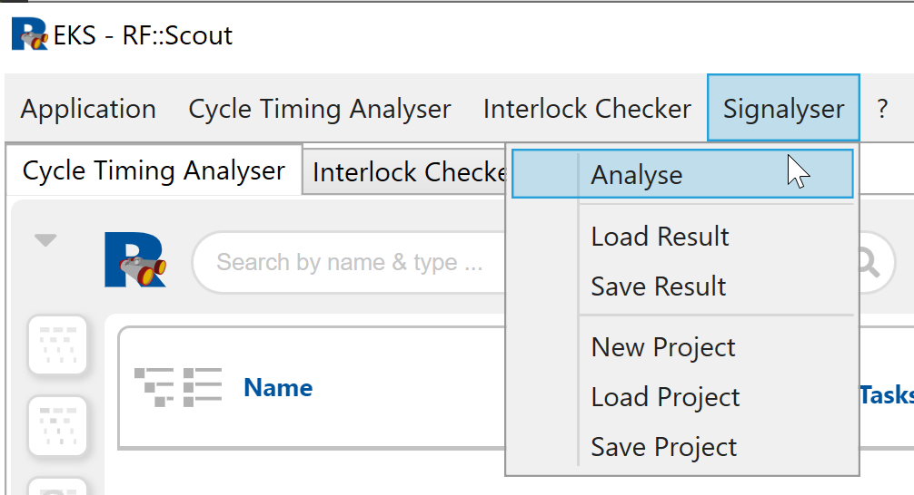

## Konfiguration
Nach Klick auf "Analyse" öffnet sich folgender Dialog:
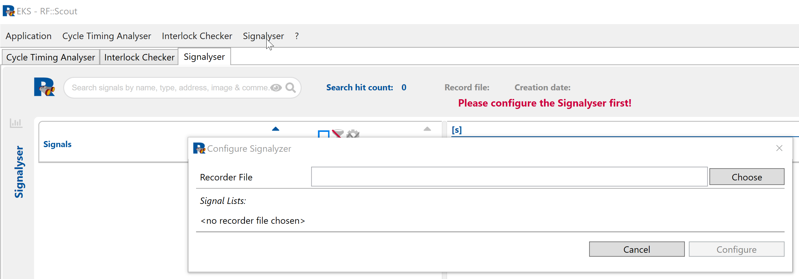
Ein Klick auf den "Choose" Button ermöglicht die Auswahl eines Recorder Files. Signalyser analysiert den ausgewählten Recorder File und stellt eine Liste zum Upload von Signallisten bereit. Dabei kann pro SharedMemory eine Signalliste ausgewählt werden. Im folgenden Beispiel wurde für die SPS (KDSTALPLC) eine Signalliste durch klick auf dne entsprechenden Choose Button hochgeladen.

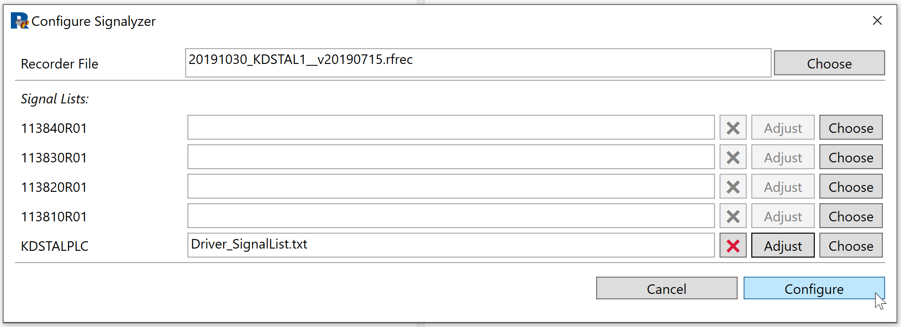

Durch einen Klick auf "Configure" analysiert Signalyser den RecorderFile mit Bezug auf die ausgewählte oder die ausgewählten Signallisten und stellt das Ergebnis zum Bearbeiten der Signalauswahl bereit.
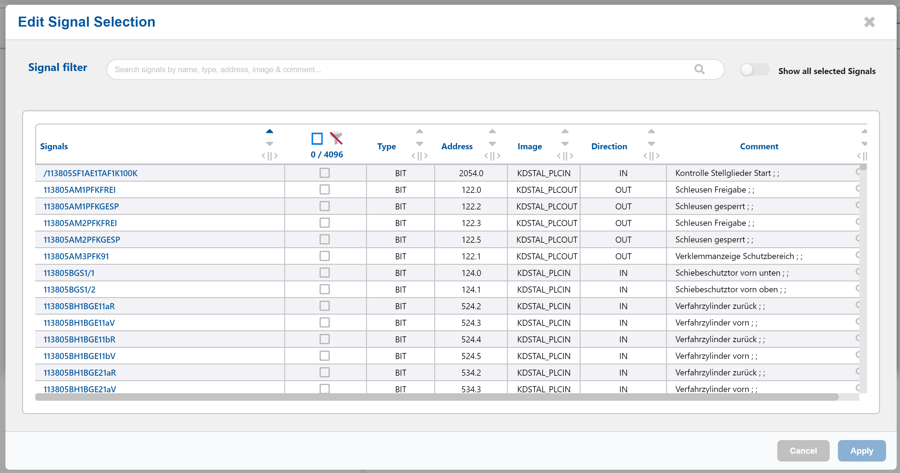
Durch Eingabe eines Suchestrings im "Signal filter" kann die Zahl der dargestellten Signale reduziert und diese für die Darstellung ausgewählt werden.
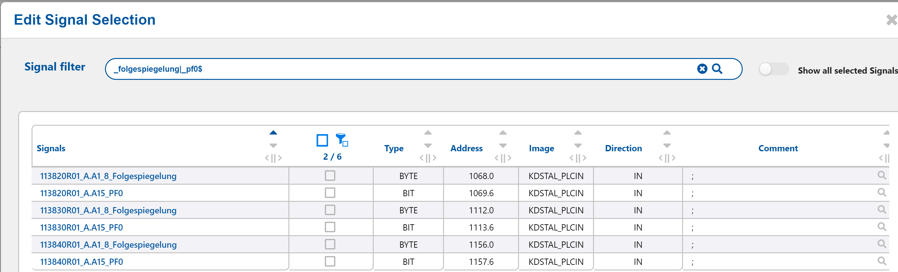

## Signalauswahl
Passt der Filter, können alle Signale der gefilterten Liste durch Auswahl der mit der Maus im nächsten Bild gezeigten Checkbox ausgewählt werden. Alternativ können auch die Checkboxen einzelner Signale aus der gefilterten Liste selektiert werden.

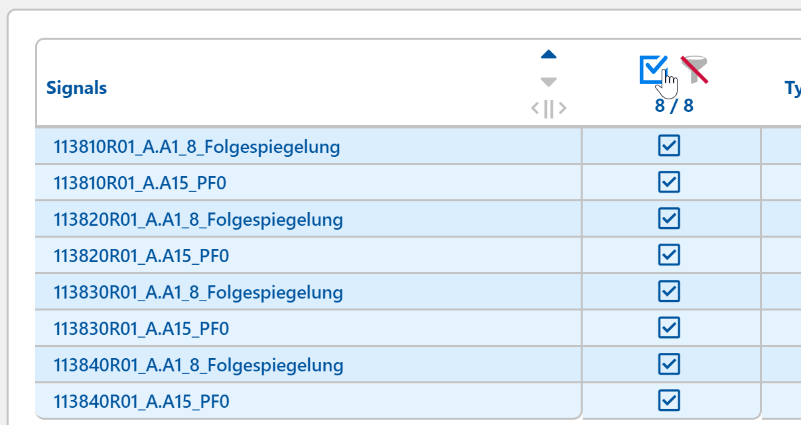

Werden nicht alle gefilterten Signale ausgewählt, ermöglichen Klicks auf das Filtericon unterschiedliche Darstellungen:
1. Alle Signale werden angezeigt. Das Filtericon erscheint grau und ist rot durchgestrichen. Die ausgewählten Signale werden mit blauem Hintergrund hervorgehoben dargestellt

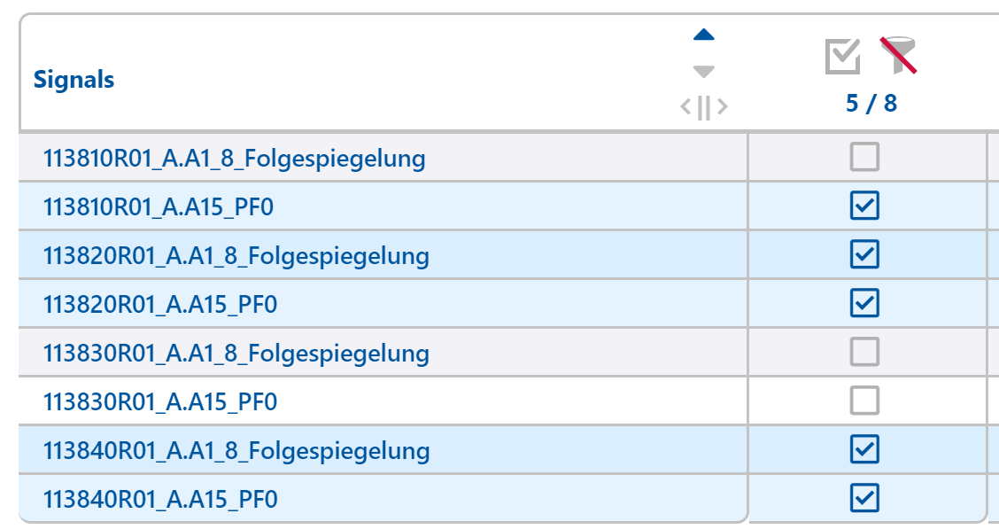

1. Nur die ausgewählten Signale werden angezeigt. Das Filtericon erscheint blau und eine kleine ausgewählte Checkbox erscheint rechts unten zum Filter Icon. Die ausgewählten Signale werden mit blauem Hintergrund hervorgehoben dargestellt
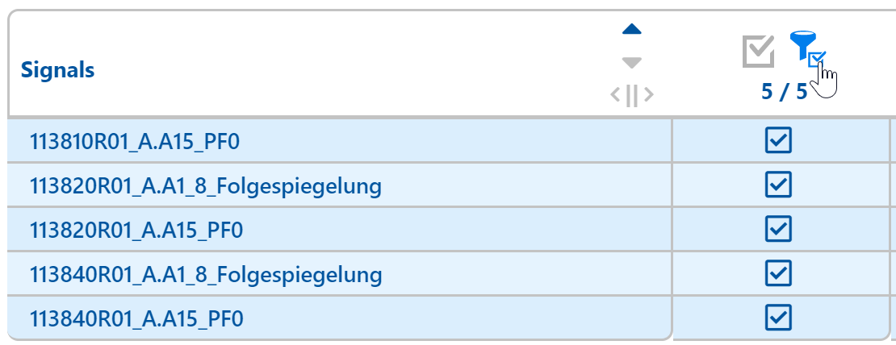
1. Nur die nicht ausgewählten Signale werden angezeigt. Das Filtericon erscheint blau und eine kleine nicht ausgewählte Checkbox erscheint rechts unten zum Filter Icon. Die Signale werden mit grauem Hintergrund dargestellt
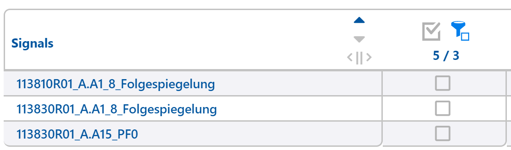
Fährt man mit der Maus über das Filter Icon wird das Symbol dargestellt, das nach dem nächsten Klick erscheinen würde.

Nach Abschluss der Auswahl klickt man den Apply Button rechts unten. Dieser enthält in Klammern auch die Anzahl der Signale, die neu zu einem möglicherweise bereits vorhandenen, Ergebnis hinzugefügt werden können. Die ausgewählten Signale werden dann auf das Record File angewendet und die Signalverläufe im Signalyser dargestellt.
Zu einem bestehenden Chart können weitere Signale hinzugefügt werden. Dazu klickt man ein Chart Icon am oberen rechten Rand des Signalysers an. Es erscheint derselbe Dialog wie weiter oben dargestellt mit den gleichen Filter- und Auswahlmöglichkeiten.
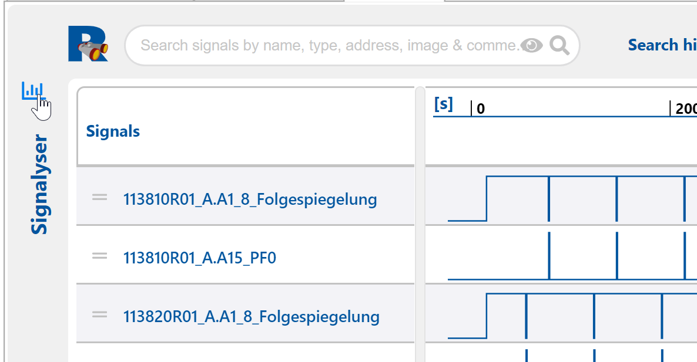
Aus der neuen Auswahl können weitere Signale der bestehenden Auswahl hinzugefügt werden. Fehlerhaft hinzugefügte oder doch nicht benötigte Signale können aus einer einmal getroffenen Auswahl wieder entfernt werden. Dazu begibt man sich in den "Edit Signal Selection" Dialog und klickt eine bereits ausgewählte Checkbox erneut an. Dadurch wandelt sich das Checkbox Symbol in ein weißes x auf roten Hintergrund um. Außerdem ändert sich die Hintergrundfarbe zur ausgewählten Zeile von blau nach grau. Anschließend noch den Apply Button drücken. Die in Klammern zum Apply Button angegeben Zahl gibt die Summe aller getätigten Klicks an. Hat man drei Signale abgewählt (dreimal weißes x aif rotem Grund) und zwei neue Signale hinzugefügt, wird (5) im Apply Button ausgegeben.
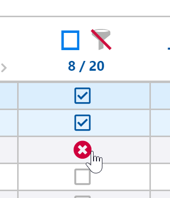

## Auswahl speichern
Nach Abschluss der konfiguration kann die Auswahl der Signale gespeichert werden. Einmal kann nur das Ergebnis gespeichert werden via "Save Result".
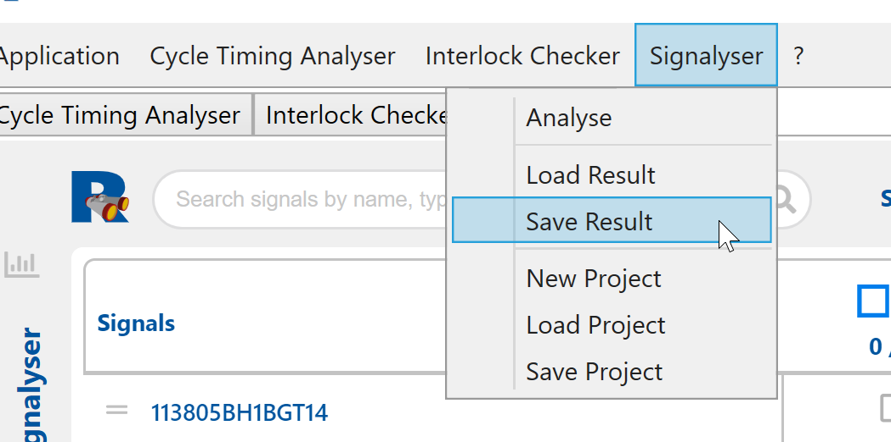
Als Ergebnis erhält man eine Datei, die genau die ausgewählten Signale zeigt.
Vorteil: Die Datei ist klein.
Nachteil: Weitere Signale aus dem ursprünglichen Recorder File können nicht hinzugefügt werden.
Alternativ kann man das Ergebnis auch als Projekt speichern.
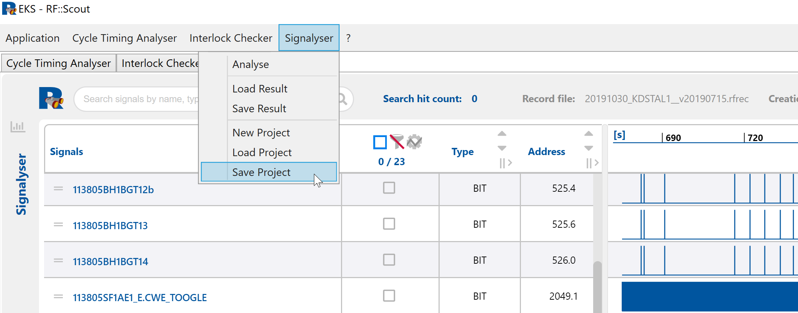
In diesem Fall werden zusätzlich zur konfigurierten Signalauswahl auch der Recorder File und alle ausgewählten Signallisten als Projekt gespeichert.
Vorteil: Man kann auf alle Signale auch noch zu einem späteren zeitpunkt zurückgreifen und die Konfiguration anpassen.
Nachteil: Die Datei wird möglicherweise sehr groß.