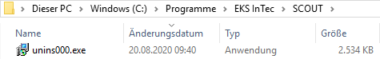
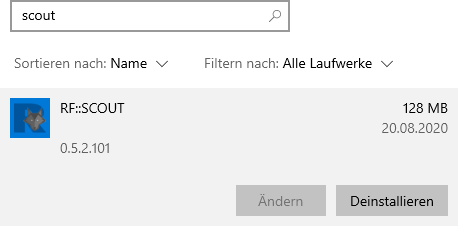
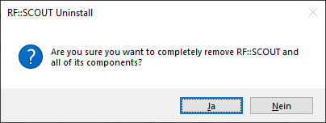
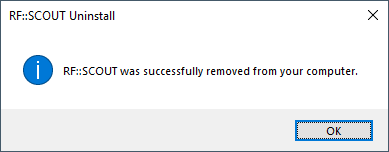

<p hidden>
Stand: 2020.08.24
Autor: D. Meißner (EKS-InTec)
Co-Autor: R. Driesang (EKS-InTec)
Übersetzung:
Dokumentenversion: 1.0
Anwendungsversion: 0.5.2.101
Anmerkungen:
</p>

# Deinstallation
---
Eine Deinstallation löscht das Verzeichnis, welches unter dem Punkt [Select Destination Location](../appendix/installation.md#select-destination-location) bei der Installation angegebenen wurde.
Eigenständig erstellte Verlinkungen und das Lokale Verzeichnis ```C:\Users\%user%\AppData\Local\EKS\rfSCOUT``` wird bei einer Deinstallation nicht gelöscht.

Die Deinstallation kann entweder

- direkt im Verzeichnis der RF::SCOUT Anwendung über den Aufruf der Deinstallationsdatei _unins###.exe_[^2] oder der Deinstalltationsdatei uninst.exe oder
- in Windows unter _Apps & Features_

vorgenommen werden.
[^2]: Die Zeichen _###_ steht für eine dreistellige Nummer.

1. Aufruf über die Deinstallationsdatei
Im Installationsverzeichnis existiert eine _unins000.exe_ Datei. Wird diese aufgerufen startet die Deinstallation von RF::SCOUT.




1. Aufruf über Windows Apps & Features



Windows Nachfrage ob die App wirklich gelöscht werden soll


Nachdem der obere Deinstallationprozess gestartet wurde beginnt die mit der Nachfragemeldung ob RF::SCOUT deinstalliert werden soll.




Die Bestätigungsmeldung das  RF::SCOUT deinstalliert wurde.


