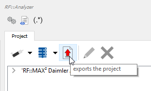
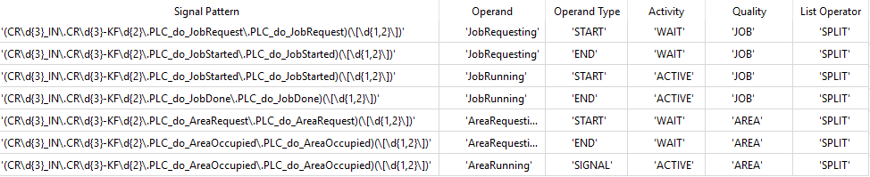

# Aktivitätskonfiguration
Für jeden Funktionsblock kann Start und Ende einer Aktivität aus einem oder mehreren Signalen konfiguriert werden. Zusätzlich kann eine Aktivität mit verschiedenen Qualitäten angereichert werden. Dabei wird bei jeder Qualität eine Wartezeit von einer Aktivitätszeit unterschieden.

Zu diesen Qualitäten zählen:

- Job
- Area
- Kollisionszone
- Umhüllende

Die Qualität "Umhüllende" definiert den gesamten Zeitraum einer Aktivität und umschließt alle anderen Qualitäten.

## Einfache Aktivitäts-Konfiguration
Im einfachen Fall, dass nur eine Aktivität über einen Balken in einem Chart dargestellt werden soll und dass es genau ein eindeutiges Start- und Endsignal gibt, wird die Qualität „Umhüllende“ verwendet und die Aktivität wie folgt konfiguriert

1. Werden zwei Signale verwendet, eines für den Start, ein anderes für das Ende der Aktivität, wird ein Signal für den „Operand Type“ "FlipFlop(Start)" (START) und ein Signal für den "Operand Type" "FlipFlop(End)" (END) konfiguriert (siehe Abbildung 4). Das Signal wird als boole’sches Signal interpretiert. Handelt es sich um ein Signal vom Typ BYTE, WORD oder DWORD, wird der Wert ‚0‘ als FALSE und der erste, beliebige von 0 abweichende Wert als TRUE interpretiert. Es wird der Zeitstempel der steigenden Flanke des jeweiligen Signals verwendet. Zu konfigurierende Elemente sind:
- **Operand**:
Freier Text, der in RF::SCOUT im Tooltipp der Aktivität als Teil des Titels ausgegeben wird
- **Operand Type**:
Es stehen die folgenden Auswahlmöglichkeiten zur Verfügung:
   - **FlipFlop(Start)**:
   Setzt den Startzeitpunkt. Wird zu START in der Tabellendarstellung. Reagiert auf eine Änderung von FALSE auf TRUE eines boole'schen Signals
   - **FlipFlop(End)**:
   Setzt den Endzeitpunkt. Wird zu END in der Tabellendarstellung. Reagiert ebenfalls auf eine Änderung von FALSE auf TRUE eines boole'schen Signals
   - **Value driven flipflop(Start)**:
   Für ein Signal, das nicht vom Typ BOOL ist wird der erste von 0 abweichende Wert als Zeitpunkt für den Start interpretiert
   - **Value driven flipflop(End)**:
   Für ein Signal, das nicht vom Typ BOOL ist wird der erste von 0 abweichende Wert als Zeitpunkt für das Ende interpretiert
   - **SIGNAL**:
   Ein boole'sches Signal, dessen Wechsel von FALSE auf TRUE den Startzeitpunkt und dessen Wechsel von TRUE auf FALSE den Endzeitpunkt definiert
   - **HEARTBEAT**:
   Obsolet, dient nur der Abwärtskompatibilität
   - **VALUE**:
   Wird als Wert eines Signals itnerpretiert und nicht als Zeitpunkt
   - **STARTVALUE**:
   - **ENDVALUE**:
   - **VALUESTREAM**:
   Ein Signal wird nicht als Zeitpunkt für Start oder Ende einer Aktivität interpretiert sondern alle Werte, die das Signal über die Zeit annimmt werden ausgelesen, so dass diese später als Kurve dargestellt werden können
- **Activity**:
ACTIVE oder WAIT. Für die einfache Konfiguration wird immer ACTIVE gewählt
- **Quality**:
ENVELOPE. Es gibt weitere Auswahlmöglichkeiten. Im Kontext der einfachen Konfiguration muss ENVELOPE ausgewählt werden
- **List Operator**:
ANY. Es gibt weitere Auswahlmöglichkeiten. Im Kontext der einfachen Konfiguration muss ANY ausgewählt werden

_Abbildung Aktivitätskonfiguration 1: Einfache Aktivität ohne Unterteilung_

2. Wird ein Signal zur Definition von Start und Ende einer Aktivität verwendet, wird die steigende und fallende Flanke eines boole’schen Signals (BOOL im oben beschriebenen Sinne) dazu verwendet. In diesem Fall muss als Operand Type „SIGNAL“ konfiguriert werden. In dieser Form wird der Zeitstempel der steigenden Flanke als Start und der der fallenden Flanke als das Ende der Aktivität interpretiert

Nach Abschluss der Konfiguration kann diese in eine Datei exportiert werden (siehe Abbildung 5), nach dem die Signalliste geladen und die Funktionsgruppen und die Datenbasis erzeugt wurden (siehe Abschnitte Heartbeat-Konfiguration und Signalkonfiguration).

_Abbildung Aktivitätskonfiguration 2: Export der Konfiguration aus MAX²_

## Komplexe Konfiguration
Bei komplexeren Aktivitäten, wie denen eines Roboters, ist es wünschenswert, neben der reinen Aktivität weitere Informationen, die im Kontext der Aktivität stehen, darzustellen. Dazu zählen das Anfragen und Ausführen beziehungsweise Belegen von Jobs, Areas und Kollisionszonen. Das Hauptprogramm eines Roboters ist in die Ausführung mehrere Unterprogramme oder Jobs unterteilt.

Für jeden Job kann eine andere Area oder Kollisionszone angefragt werden. Dieses Mehrfachvorkommen wird über eine einzige Zeile (SIGNAL) oder über genau zwei Zeilen (START/END) für alle Areas und Kollisionszonen, die ein Roboter belegen kann, konfiguriert.

Die folgende Abbildung zeigt beispielhaft Signalpattern und die Konfiguration für die eben beschriebenen Aspekte, wobei in Spalte "Operand Type" START und ENDE zwar angezeigt aber durch die Elemente "FlipFlop (Start)" beziehungsweise "FlipFlop (End)" ausgewählt werden:

_Abbildung Aktivitätskonfiguration 3: Signalmuster und Konfiguration weiterer Aspekte einer Aktivität_

Über diese Untergliederung kann die Aktivität zum Beispiel eines Roboters feingranularer aufgeschlüsselt und zusätzlich zwischen aktiven Zuständen und Wartezeiten unterschieden werden. Diese Aufgliederung ist die Basis für weitere Auswertungen und Statistiken, die in RF::SCOUT ausgegeben werden.
1. **Signal Pattern**: der letzten Ausdruck „(\\[\d{1,2}\])“ erlaubt, dass mehrere Signale auf einmal konfiguriert werden. Wie das Mehrfachvorkommen der Signale interpretiert werden soll, wird über den „List Operator“ bestimmt, siehe dort
1. **Operand**: Wie bei der einfachen Konfiguration kann in der Spalte „Operand“ ein freier Text eingegeben werden, der im Titel des Tooltipps erscheint
1. **Operand Type**: Es stehen die folgenden Auswahlmöglichkeiten zur Verfügung:
   - **FlipFlop(Start)**: Setzt den Startzeitpunkt. Wird zu START in der Tabellendarstellung. Reagiert auf eine Änderung von FALSE auf TRUE eines boole'schen Signals
   - **FlipFlop(End)**: Setzt den Endzeitpunkt. Wird zu END in der Tabellendarstellung. Reagiert ebenfalls auf eine Änderung von FALSE auf TRUE eines boole'schen Signals
   - **Value driven flipflop(Start)**: Für ein Signal, das nicht vom Typ BOOL ist wird der erste von 0 abweichende Wert als Zeitpunkt für den Start interpretiert
   - **Value driven flipflop(End)**: Für ein Signal, das nicht vom Typ BOOL ist wird der erste von 0 abweichende Wert als Zeitpunkt für das Ende interpretiert
   - **SIGNAL**: Ein boole'sches Signal, dessen Wechsel von FALSE auf TRUE den Startzeitpunkt und dessen Wechsel von TRUE auf FALSE den Endzeitpunkt definiert
   - **HEARTBEAT**: obsolet, dient nur der Abwärtskompatibilität
   - **VALUE**: wird als Wert eines Signals itnerpretiert und nicht als Zeitpunkt
   - **STARTVALUE**:
   - **ENDVALUE**:
   - **VALUESTREAM**: Ein Signal wird nicht als Zeitpunkt für Start oder Ende einer Aktivität interpretiert sondern alle Werte, die das Signal über die Zeit annimmt werden ausgelesen, so dass diese später als Kurve dargestellt werden können
1. **Activity**:
   - **WAIT**: Beschreibt, ob es sich um eine Anfrage handelt. In diesem Fall muss gewartet werden, bis die Anfrage bestätigt wird. Danach wechselt der Zustand in
   - **ACTIVE**: Start eines Jobs oder Belegen einer Area oder Kollisionszone
1. **Quality**:
   - **ENVELOPE**: Umhüllende, beschreibt die Gesamtaktivität, die alle anderen Elementge wie Jobs, Areas und Kollisionszonen umschließt
   - **JOB**: produktive oder nicht-produktive Tätigkeit
   - **AREA**: Anfragen und Belegen einer Area
   - **COLLZONE**: Anfragen und Belegen einer Kollisionszone
1. **List Operator**
   - **ANY**: Es wird das erste Startsignal gesucht und dann alle weiteren Startsignale ignoriert bis zum ersten Endsignal. Danach wird wieder nach einem Startsignal gesucht usw.
      - **Operand Type START/END**: Das erste gefundene Signal mit steigender Flanke bestimmt den Startzeitpunkt. Das erste gefundene Signal mit fallender Flanke bestimmt den Endzeitpunkt
      - **Operand Type SIGNAL**: Das erste gefundene Signal bestimmt Start (steigende Flanke) und Endzeitpunkt (fallende Flanke).
   - **ALL**: Wenn alle gefundenen Signale TRUE sind, bestimmt den Startzeitpunkt. Wenn alle gefundenen Signale FALSE sind, bestimmt den Endzeitpunkt
   - **SPLIT**: Die Signale zu START und END werden in einer Tabelle mit den Spalten START und END alphabetisch sortiert. Die Signale, die in der gleichen Zeile in der Tabelle stehen, beschreiben einen Balken und werden jeweils als Start- beziehungsweise Endzeitpunkt interpretiert
