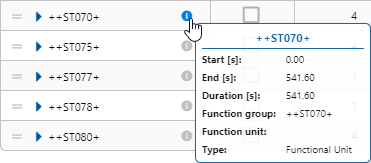
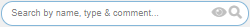
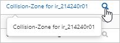
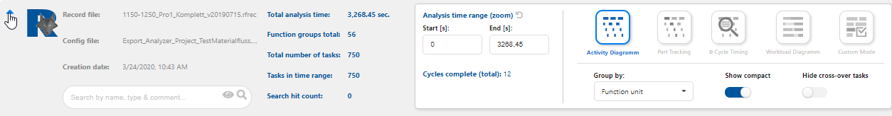
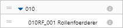
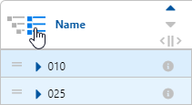

# Icons as Button

## Info-Circle
:fontawesome-solid-info-circle: Wird das Info-Circle Icon gedrückt oder wird über das Icon mit der Maus drübergefahren (Mouseover) erscheint eine Box mit weiteren Informaionen zu dem ensprechenden Objekt bzw. Eintrag. Siehe auch das [Icon :fontawesome-solid-search:](#search-and-info) innerhalb einer Tabellenzeile.

Beispiel aus dem "Process Analysis" Tab:

## Search and Info
:fontawesome-solid-search: Im Suchfeld hat das Icon nur eine informative Funktion. Es zeigt dem Benutzer an, dass das Feld ein Suchfeld ist.

In einer Tabellenzelle z.B. "Comment" hat das Icon die gleiche Funktion wie das  [:fontawesome-solid-info-circle: Icon](#info-circle) [^1]

[^1]: **ANMERKUNG:** Das Icon :fontawesome-solid-search: sollte hier durch das Icon :fontawesome-solid-info-circle: ausgetauscht werden.

## Tabellenspaltenbreite
:fontawesome-solid-chevron-left:||:fontawesome-solid-chevron-right: In jeder Tabellenkopfzeile ist diese Iconkombination enthalten. Mit der Maus kann durch drücken der Icons und gleichzeitigem bewegen der Maus die Tabellenspaltenbreite verkleinert oder vergrößert werden. Kann die Tabellenspaltenbreite nicht mehr verkleinert werden ändert sich die Iconkombination in ||:fontawesome-solid-chevron-right:. Ebenso wird es zu Iconkombination :fontawesome-solid-chevron-left:|| wenn die Tabellenspaltenbreite nicht mehr verglößert werden kann.

## Einblenden und Ausblenden
:fontawesome-solid-eye: :fontawesome-solid-eye-slash: Diese zwei Icons sind Wechselicons. Wird das :fontawesome-solid-eye: Icon gedrückt wechselt es zum :fontawesome-solid-eye-slash: Icon und umgekehrt.
Im Suchfeld wird durch drücker des Icons die Elternelemente von gesuchten und gefundenen Elementen, die nicht den Suchbegriff entsprechen, ein- und ausgebelendet.
 
Werden die Icon in einem Anzeigebereich angezeigt und gedrückt werden Elemente ein- und ausgeblendet.[^2]
 
Für den Robot-Collision-Status Button wird das Icon in Kombination mit dem  [:fontawesome-solid-share-alt: Share Icon](#robot-collision-status) verwendet und blendet den Anzeigenbereich vom "Robot Collision Status" Ein bzw. Aus.
 
[^2]: **ANMERKUNG:** Die Icons :fontawesome-solid-eye: und :fontawesome-solid-eye-slash: werden nicht eindeutig verwendet. Das Icon zeigt einmal an was es beim Drücken des Icons tun wird und einemal zeigt es an was es getan hat.

## Robot Collision Status
:fontawesome-solid-share-alt: Dieses Share Icon wird in Kombination mit den [:fontawesome-solid-eye::fontawesome-solid-eye-slash:](#Einblenden-und-Ausblenden) Icons verwendet. Es blendet den Anzeigenbereich vom "Robot Collision Status" Ein bzw. Aus.
 

## sort-up und sort-down
:fontawesome-solid-sort-up::fontawesome-solid-sort-down: In einer Tabellenkopfzeile werden diese Icons verwendet um die Tabellenspalte zu sortieren. Ein nochmaliges Drücken eines Icon deaktiviert die Sortierung und die Benutzerdefinierte Sortierung wird angezeigt.

## caret down und caret up
:fontawesome-solid-caret-down::fontawesome-solid-caret-up: Diese zwei Icons sind Wechselicons. Wird das :fontawesome-solid-caret-up: Icon gedrückt wechselt es zum :fontawesome-solid-caret-down: Icon und umgekehrt. Im Anzeigenbereich wird damit die Kopfinformation Auf- und Zuklappen und zeigt damit mehr oder weniger Informationen an.

## caret-right und caret-down
:fontawesome-solid-caret-right::fontawesome-solid-caret-down: Diese zwei Icons sind Wechselicons. Wird das :fontawesome-solid-caret-right: Icon gedrückt wechselt es zum :fontawesome-solid-caret-down: Icon und umgekehrt. In einem Tabellenfeld zeigt das :fontawesome-solid-caret-right: Icon bei einem Elternelement an das es noch Kindelemente gibt. Diese können durch drücken des Icon einzelnd aufgeklappt werden.
 
Sollen alle Elternelemente auf- oder zugeklappt werden sind hierfür die Image Buttomen
@import "Bilder/einklappen_primary.fa02e0a4.svg" {width="15px"}
@import "Bilder/ausklappen_primary.09cf35c7.svg" {width="15px"}
["Einklappen und Ausklappen"](#liste-einklappen-und-ausklappen) vorhanden. ###Amerkung text durch svg image tauschen und verlinken###

## Remove
:fontawesome-solid-remove: Dieses Icon entfernt einen Eintrag oder eine Auswahl.
Im Suchfeld wird der Suchbegriff nach dem drücken des Icons aus dem Suchfeld gelöscht.

In einer Tabelenzeilenauswahl zeigt es an das die Tabellenzeile nicht mehr übernommen wird.

Wird das Icon in der oberen rechten Ecke eines Fenstern angezeigt, wird das Fenster nach dem Drücken des Icon geschlossen.

## Refresh
:fontawesome-solid-undo: Dieses Icon setzt eine Eingabe zurück. Wird das Icon gedrückt wird eine vorher getätigte Eingabe zurückgesetzt. Siehe auch das Icon [:fontawesome-solid-remove:](#remove) innerhalb des Suchfeldes.

## Searche plus und Search minus
:fontawesome-solid-search-plus::fontawesome-solid-search-minus: Diese zwei Icons sind Wechselicons. Wird das :fontawesome-solid-search-plus: Icon gedrückt wechselt es zum :fontawesome-solid-search-minus: Icon und umgekehrt. Innerhalb eines Tabellenfeldes werden diese zwei Icons verwendet um mehr oder weniger Informationen des entsprechenden Feldes anzuzeigen.
Es unterscheidet sich zu den Icons [:fontawesome-solid-caret-right::fontawesome-solid-caret-down:](#caret-right-und-caret-down) in dem Sinn, dass keine weiteren Kinderelemente bzw. Tabellenzeilen angezeigt werden sondern die bestehende einzelne Tabellenzeile bzw. das Element erweitert wird.

In der Zeitskala erscheint das :fontawesome-solid-search-plus: Icon zudem. Hier ist es ein Mauszeiger, mit dem, mittels dem Mausrades, gezoomt werden kann. Siehe hierzu auch [1:1](#text-as-button)

## Save
:fontawesome-solid-save: Das Save Icon speichert Änderungen im Costumer Mode der Process Analysis.

## Chart bar
:fontawesome-solid-chartbar: Dieses Icon öffnet die "Edit Signal Selection" Anzeige im Signalyser.

## Setting
:fontawesome-solid-cog: Wird dieses Zahnradicon gedrückt öffnet sich immer ein Dialog um zusätliche Einstellungen vornehmen zu können.

## dark mode (moon and sun)
:fontawesome-solid-moon: :fontawesome-solid-sun: Diese zwei Icons sind Wechselicons. Wird das :fontawesome-solid-moon: Icon gedrückt wechselt es zum :fontawesome-solid-sun: Icon und umgekehrt. Die Optik der Anwendung kann mit diesen Icons auf Darkmode umgestellt werden.

# Image as Button
## Liste Einklappen und Ausklappen
@import "Bilder/einklappen_primary.fa02e0a4.svg" {width="25px"}
@import "Bilder/ausklappen_primary.09cf35c7.svg" {width="25px"}

Diese zwei Button öffnen alle Kindelemente einer Anzeige. Einzelne Kindelemente in der Anzeige können mit dem [:fontawesome-solid-caret-right: und :fontawesome-solid-caret-down:](#caret-down-und-caret-up) Icon angezeigt bzw. geöffnet werden.

## Checkbox
@import "Bilder/checkbox_checked_primary.f0678640.svg" {width="25px"}
@import "Bilder/checkbox_checked_secondary.e5b8561c.svg" {width="25px"}
@import "Bilder/checkbox_secondary.ca8b606f.svg" {width="25px"}
@import "Bilder/checkbox_primary.ac154ac6.svg" {width="25px"}

Die Checkbox Button stehen in Verbindung mit den [Filter Buttons](#filter), dem [Edit Curve Button](#edit-curve) und dem [Costumer Mode](#benutzeransicht). Im Costomer Mode werden mit dem Checkbox Button ausgewählte Elemente in diesen übernommen. In Kombination mit den Filter Buttons können Elemente in Anzeigenbereich ein und unsgeblendet werden.

## Filter
@import "Bilder/no_filter_primary.d864d568.svg" {width="25px"}
@import "Bilder/no_filter.81583707.svg" {width="25px"}
@import "Bilder/filter_checked_2_primary.3f87db0d.svg" {width="25px"}
@import "Bilder/filter_checked_2.d2d972f5.svg" {width="25px"}
@import "Bilder/filter_unchecked_3_primary.8332adcf.svg" {width="25px"}
@import "Bilder/filter_unchecked_3_secondary.aa9edac0.svg" {width="25px"}

Die Filter Buttons stehen in Verbindung mit den [Checkbox Button](#checkbox). Es sind drei Wechselbutton die in der folgenden Reihenfolge wechseln:

@import "Bilder/no_filter_primary.d864d568.svg" {width="25px"}
@import "Bilder/filter_checked_2_primary.3f87db0d.svg" {width="25px"}
@import "Bilder/filter_unchecked_3_primary.8332adcf.svg" {width="25px"}

Wird mit der Maus über den aktiven Button gefahren zeigt das System den nachfolgenden Button an, der bei einem Drücken des aktiven Buttons aktiv werden würde.

@import "Bilder/no_filter_primary.d864d568.svg" {width="25px"}
Dieser Button deaktiviert den Filter. Es werden alle ausgewählten und nicht ausgewählten Elemente im Anzeigenbereich angezeigt.

@import "Bilder/filter_checked_2_primary.3f87db0d.svg" {width="25px"}
Dieser Button aktiviert den Select-Filter. Es werden alle, mittels Checkbox Button, ausgewählten Elemente angezeigt.

@import "Bilder/filter_unchecked_3_primary.8332adcf.svg" {width="25px"}
Dieser Button aktiviert den Unselect-Filter. Es werden alle, mittels Checkbox Button, ausgewählten Elemente ausgeblendet.

## Edit Curve
@import "Bilder/edit_curve2.add636c5.svg" {width="25px"}
@import "Bilder/edit_curve2_inactive.a937cf91.svg" {width="25px"}

Die Edit Curve Buttons stehen in Verbindung mit den [Checkbox Button](#checkbox). Mit dem Checkbox Button ausgewählten Signalkurven können nach dem Drücken des Edit Curve Button visual verändert werden. Hierzu öffnet sich eine Fenster zum Editieren der Signals

## Aktivitätendiagramm
@import "Bilder/Aktivitaetsdiagramm.1201bdc4.svg" {width="25px"}
@import "Bilder/Aktivitaetsdiagramm_inaktiv.cae285b2.svg" {width="25px"}

Der Button aktiviert das Activity Diagram. Es zeigt alle Akrivitäten an, die durch eine Analyse oder einer gelandenen Ergebnis Datei vorhanden sind.

## Ablaufdiagramm
@import "Bilder/Ablaufdiagramm.db400b3b.svg" {width="25px"}
@import "Bilder/Ablaufdiagramm_inaktiv.eddc2374.svg" {width="25px"}

Der Button aktiviert das Part Tracing Diagram. Es zeigt alle Akrivitäten an, die durch eine Analyse oder einer gelandenen Ergebnis Datei vorhanden sind. Hierbei werden wiederholende Abschnitte farblich gekennzeichnet.

## Taktzeit-Diagramm
@import "Bilder/Taktzeit-Diagramm.86f7b847.svg" {width="25px"}
@import "Bilder/Taktzeit-Diagramm_inaktiv.c08e63cc.svg" {width="25px"}

Der Button aktiviert das [∅](#bezeichner) Cycle Timing. Es zeigt alle Akrivitäten an, die durch eine Analyse oder einer gelandenen Ergebnis Datei vorhanden sind. Hierbei werden wiederholende Abschnitte als Durchschnitt zusammengerechnet und als Minimum, Durchschnitt und Maximum farbllich in der Anzeige gekennzeichnet.

## Auslastungsdiagramm
@import "Bilder/Auslastungsdiagramm.4880f38f.svg" {width="25px"}
@import "Bilder/Auslastungsdiagramm_inaktiv.fa448742.svg" {width="25px"}

Der Button aktiviert das Workload Diagram. Es zeigt alle Akrivitäten an, die durch eine Analyse oder einer gelandenen Ergebnis Datei vorhanden sind. Die Anzeige ist identisch mit dem [Ablaufdiagramm](#ablaufdiagramm), es wird zudem eine Spalte mit der Auslastungs angezeigt.

## Benutzeransicht
@import "Bilder/CustomMode_new.a75b51e2.svg" {width="25px"}
@import "Bilder/CustomMode_new_inactive.4f5aa9dd.svg" {width="25px"}

Der Button aktiviert den Customer Mode. Es wird ein zusätzlicher Anzeigebereich geöffnet in dem der Benutzer einzelne Aktivitäten aus dem [Aktivitätendiagramm](#aktivitätendiagramm) mittels den [Checkbox Button](#checkbox) übernehmen und später mit dem [Save Icon](#save) speichern kann.

## Roboter
@import "Bilder/Roboter_32x32_red.a7737167.svg" {width="25px"}
@import "Bilder/Roboter_32x32_green.9e40da35.svg" {width="25px"}

Robotor

# Text as Button
## 1:1
Wird der Text "1:1" am rechten Ende in einer Zeitskala gedrückt wird eine vorher gezoomte Zeitskala zurückgesetzt.

# Abkürzungen
## Einheiten
**min** (Minuten): bedeutet die angezeigte Zahl ist eine Minuten Angabe.
**sec** und **[s]** (Sekunden): bedeutet die angezeigte Zahl ist eine Sekunden Angabe.
**ms** (Millisekunden): bedeutet die angezeigte Zahl ist eine Millisekunden Angabe.
**AM** (Ante Meridiem): bedeutet "vor dem Mittag".
**PM** (Post Meridiem): bedeutet "nach dem Mittag".

## Bezeichner
**∅** (Durchschnitt): bedeutet die angezeigte Zahl ist ein Durchschnittswert.
**\#** (Anzahl): bedeutet die angezeigte Zahl ist eine Anzahl von Elementen
**Max.** (Maximal): bedeutet die angezeigte Zahl ist ein maximal Wert.
**Min.** (Minimal): bedeutet die angezeigte Zahl ist ein minimal Wert.