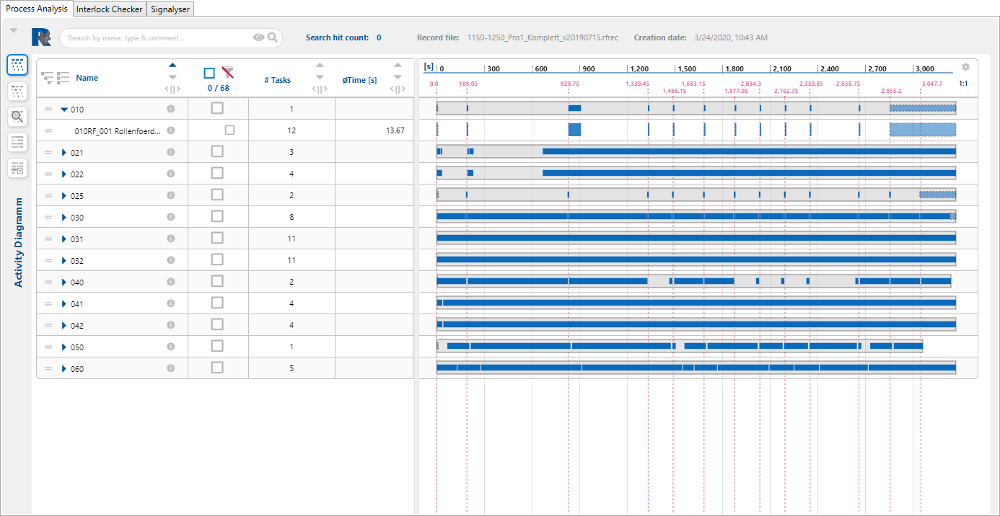
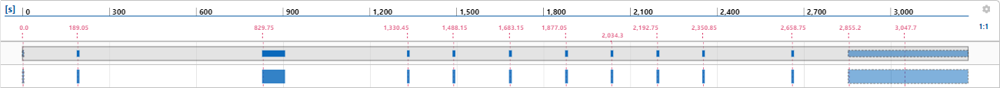

# Process Analysis

Im Bereich der Prozessanalyse stehen mehrere Module zur Verfügung, um den Ablauf innerhalb einer Zelle untersuchen zu können. Bei diesen Modulen handelt es sich um ein Aktivitätsdiagramm, Teiledurchlauf, durchschnittliches Taktzeitdiagramm und ein Auslastungsdiagramm sowie einen Kunden-Modus, in dem der Anwender selbst die Möglichkeit hat, interessierende Aspekte zusammenzustellen. Grundlage für alle Analysen ist das Vorhandensein einer Aufnahme oder einer Ergebnisdatei. Eine Ergebnisdatei selbst wurde unter Anwendung einer Aufnahme erstellt und zur Verfügung gestellt. Um eine Analyse zu starten, gibt es demnach zwei Möglichkeiten: 1) Laden einer Aufnahme zusammen mit einer passenden Konfigurationdatei. 2) Laden einer Ergebnisdatei.

## Anzeigenbereich
Der Anzeigenbereich der Process Analysis ist in verschiedene Bereiche gegliedert (siehe auch [Oberfläche](Oberfläche.html)), die im Einzelnen in den folgenden Abschnitten beschrieben sind.
TODO: Bild des Process Analysers in dem die Namen der verschiedenen Bereiche eingetragen sind.

<!-- Bei einem ß funktioniert der Verweis nicht -->
### Grosse Informationskopfzeile
Die große Informationskopfzeile gliedert sich in drei Bereiche: links und grau unterlegt Informationen zum geladenen File, darunter eine Freitextsuche mit Filterelementen und rechts ein Funktionsbereich mit [Buttons](#buttons) und weiteren Funktionselementen.

Die Informationen im grauen Bereich umfassen:

- **Record file:**
In dem Feld wird der Name der geladenen Rekord Datei angezeigt. Diese wird über den Menüpunkt _Process Analysis_, über _Analyse_ der RF::SCOUT Anwendung geladen. Wird eine Analyse als Result gespeichert wird der Name der Record Datei mit in das Result gespeichert und beim Laden eines Results angezeigt. Über diese Angabe ist ersichtlich aus welcher Record Datei die Anzeige erstellt wurde.

- **Config file:**
In dem Feld wird die geladene Config Datei angezeigt. Diese wird über den Menüpunkt _Process Analysis_, über _Load Result_ der RF::SCOUT Anwendung geladen. Wird eine Analyse als Result gespeichert wird der Name der Config Datei mit in das Result gespeichert und beim Laden eines Results angezeigt. Über diese Angabe ist ersichtlich welche Config Datei der Analyse zu Grunde liegt.

- **Creation date:**
In dem Feld wird das Erstellungsdatum der Analyse angezeigt. Es ist nicht das Speicherdatum einer Result Datei. Dieses Wird in der RF::SCOUT Anwendung nicht angezeigt.

- **Total analysis time:**
In dem Feld wird die Zeitspanne in Sekunden der kompletten Record Datei angezeigt. Dieser Wert wird zudem im Feld "End [s]" der "[Analysis time range](#analysis-time-range) (zoom)" als Maximaler Wert berücksichtigt.

- **Function groups total:**
In dem Feld wird die Anzahl der Funktionsgruppen angezeigt, die in dem Analysezeitraum liegen. Die Anzahl wird somit durch die Angaben in der "[Analysis time range](#analysis-time-range) (zoom)" beeinflusst. Zudem wird der Wert durch die Option "[Hide cross-over Task](#hide-cross-over-tasks)"  beeinflusst. Die maximale Anzahl der Funktionsgruppen ist die Anzahl, der in der Rekord Datei vorhandenen Funktionsgruppen.

- **Total number of tasks:**
In dem Feld wird die Anzahl der Task angezeigt, die in der Rekord Datei vorhandenen sind.

- **Task in time range:**
In dem Feld wird die Anzahl der Task angezeigt, die in dem Analysezeitraum liegen. Die Anzahl wird somit durch die Angaben in der "[Analysis time range](#analysis-time-range) (zoom)" beeinflusst. Die maximale Anzahl der Task ist die Anzahl, die in der Rekord Datei vorhandenen Task.

- **Search hit count:**
In dem Feld wird die Anzahl der über das [Suchfeld](#suchfeld) gefundenen Einträge Angezeigt.

### Kleine Informationskopfzeile
In der kleinen Informationskopfzeile sind die [Buttons](#buttons) links in der Buttonspalte und die eingeklappte Kopfzeile zeigt nur die wesendlichen Informationen.

- Search hit count siehe ([Grosse Informationskopfzeile](#grosse-informationskopfzeile)),
- Record file siehe ([Grosse Informationskopfzeile](#grosse-informationskopfzeile)) und
- Creation date siehe ([Grosse Informationskopfzeile](#grosse-informationskopfzeile)).

## Tabelle
Die Tabelle zeigt die geladenen Elemente mit den Feldern "Name", "Checkbox", "# Tasks", "∅ Time [s]", "Min. Time [s]", "Max. Time [s]", "Type", "Function unit"" und "Comment". Siehe hierzu auch [Einheiten und Bezeichner](#abkürzungen).

Der Inhalt der Tabelle wird durch Auswahl des "Workload Diagram" Buttons sowie den Feldern "Search" und "Group by" beeinflusst.

--8<-- "docs/.imports/rfscout/20.13.21/sp/buttons/button_workloaddiagram.md"

--8<-- "docs/.imports/rfscout/20.13.21/sp/feld/feld_suche.md"

--8<-- "docs/.imports/rfscout/20.13.21/sp/feld/feld_groupby.md"

## Zeitskala
<!-- Die Zeitskala zeigt die aufgezeichneten Taktzeiten der einzelnen Tabelleneinträge. -->

Wird eine Redorcing- oder Ergebnisdatei geladen, wird bei der initialen Darstellung die Gesamtdauer der Aufzeichnung dargestellt. Aktivitäten der Start- beziehungsweise Endezeitpunkt nicht im Recording liegen, werden in der eine hellere Zeichnung und durch eine gestrichelte Umrandung unterschieden. Das dargestellte Intervall kann über das Drücken der Umschalttaste und zeitgleichem Bedienen des Mausrads verkleinert beziehungsweise vergrößert werden. Der Mauszeiger muss sich dabei über dem Chart befinden. Wird die Umschalttaste zusammen mit der primären Maustaste gedrückt, kann der ausgewählte Bereich horizontal verschoben werden. Der jeweils ausgewählte Zeitbereich wird in der Zeitskala angezeigt. Die zeitliche Auflösung ändert sich dabei automatisch. Der darzustellende Bereich kann auch durch die Felder der "Analysis time range (zoom)",

- "Start [s]",
- "End [s]" 
gewählt werden.

Über die "Display options", erreichbar über das Zahnradsymbol am rechten Rand, können weitere Informationen eingeblendet werden:

<!-- - "Hide cross-over tasks", -->
- "Show heartbeat timestamp", zeigt den Zeitpunkt des Beginns eines neuen Taktes an
- "Show cycle lengths" zeigt die Dauer zwischen zwei aufeinander folgenden Heartbeats

<!-- - "Show compact", -->
Hat man mit der Zoom- oder Verschiebefunktion einen anderen Bereich gewählt als durch die Analysis time range vorgegeben, kann mit dem Button "1:1" wird wieder auf diesen zurückgesetzt werden.

Die Auswahl des Moduls ["∅ Cycle Timing"](#taktzeit-diagramm) wirkt sich insofern auf die Zeitskala aus, dass die Geamtdauer von der Taktlänge bestimmt wird.
<!-- TODO: Bild anpassen -->

--8<-- "docs/.imports/rfscout/20.13.21/sp/feld/feld_analysistimerange.md"

### Display options

Display Options finden  sich an zwei Stellen. Zum einen können "Show compact" und "Hide cross over tasks" direkt über einen Schieberegler in der ausgeklappten Kopfinformationszeile ausgewählt werden. 

Zudem sind diese und weitere Einstellungen über das Setting Icon :fontawesome-solid-cog: in der rechten oberen Ecke der Zeitskala möglich.

--8<-- "docs/.imports/rfscout/20.13.21/sp/displayopt/display_option_hiden_cross_over_tasks.md"

--8<-- "docs/.imports/rfscout/20.13.21/sp/displayopt/display_option_show_heartbeat_timestamps.md"

--8<-- "docs/.imports/rfscout/20.13.21/sp/displayopt/display_option_show_cycle_lengths.md"

--8<-- "docs/.imports/rfscout/20.13.21/sp/displayopt/display_option_show_compact.md"

### Buttons

--8<-- "docs/.imports/rfscout/20.13.21/sp/processanalysis/activitydiagram.md"

--8<-- "docs/.imports/rfscout/20.13.21/sp/processanalysis/parttracking.md"

--8<-- "docs/.imports/rfscout/20.13.21/sp/processanalysis/avgCycleTiming.md"

### Maus

Befindet sich der Mauszeiger über dem Chartbereich inklusive Skala und wird das Mausrad mit gleichzeitiger gedrückter ++Shift++ Taste gedreht, wird hineingezoomt bzw. herausgezoomt. Wird die Maus mit gedrückter primärer Maustaste und gleichzeitig gedrückter ++Shift++ Taste bewegt, wird die Zeitskala verschoben. Ein verschieben ist nur möglich, wenn vorher hineingezoomt wurde.

Wird das Mausrad mit gleichzeitiger gedrückter ++Strg++ Taste gedreht, wird die Anwendung vom Browser vergrößert bzw. verkleinert.
