<p hidden>
Stand: 2020.08.24
Autor: D. Meißner (EKS-InTec)
Co-Autor: R. Driesang (EKS-InTec)
Übersetzung:
Dokumentenversion: 1.0
Anwendungsversion: 0.5.2.101
Anmerkungen:
</p>

# Installation
---
Systemvoraussetzungen:

- Windows 10 Home, Pro, oder Enterprise, 64-Bit wird unterstützt.
- Prozessor, minimal Intel Core i3 optimal Intel Core i7.
- Arbeitsspeicher, minimal 4 GB optimal 8 GB.
- SSD Festplatte für die Erstinstallation, minimal 1 GB freier Speicher. Aus performance Gründen sollte eine SSD einer HDD vorgezogen werden.
- Dongle bzw. Lizenz um RF::SCOUT zu starten.

## Installations prozedur
Nachfolgend werden die Installationsschritte und deren Informationsmeldungen beschrieben. Es beschreibt die Abfolge der Installation.

### Welcome Screen
Informationen zu der zu installierenden Anwendung <p style="font-family:Arial"><b>RF::SCOUT</b></p>. An dieser Stelle wird die Versionsnummer der RF::SCOUT Anwendung angezeigt und die Information, dass alle offenen Anwendungen (hiermit sind alle offenen Anwendungen gemeint) geschlossen werden müssen. Die RF::SCOUT Versionnummer kann an dieser Stelle mit der Versionsnummer der bestellten Versionsnummer überprüft werden.

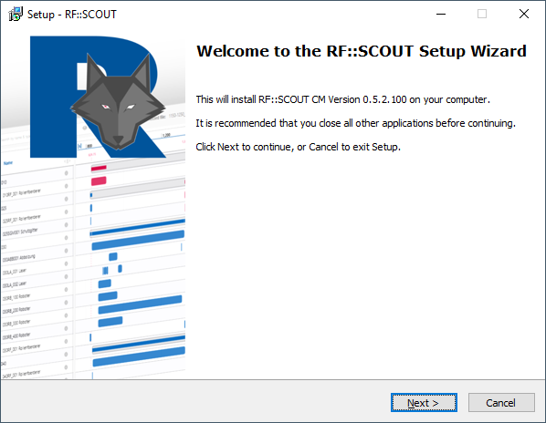

### License Agreement
Die nächste Abbildung zeigt die Informationen zu den Lizenzbedingungen. Diese müssen Akzeptiert werden um die Installation fortzuführen.

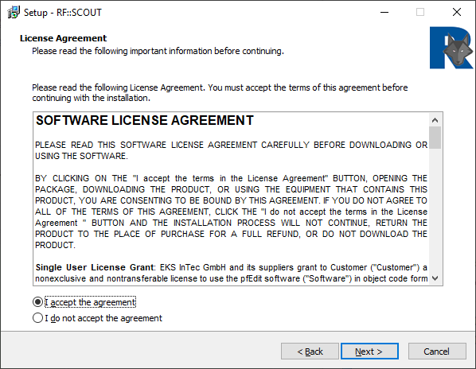

### Select Destination Location
Wird RF::SCOUT erstmalig installiert, wird der Speicherort vom Benutzer abgefragt. Der Standard Speicherort ist ```C:\Program Files\EKS InTec\SCOUT```. Wird eine neue Version über eine ältere Version von RF::SCOUT installiert wird der existierende Speicherort der Erstinstallation verwendet. An dieser Stelle darf der Speicherort nicht die Laufwerksbezeichnung A: oder B: haben und muss ein internes Laufwerk sein.

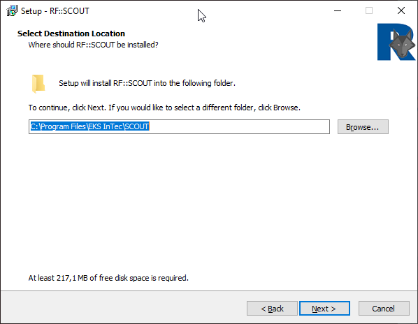

### Ready to Install
Der Installationsbildschirm zeigt an, dass RF::SCOUT installiert werden kann.

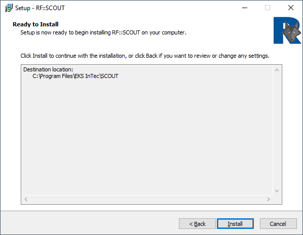

### Installing
Die Installations Fortschrittsanzeige

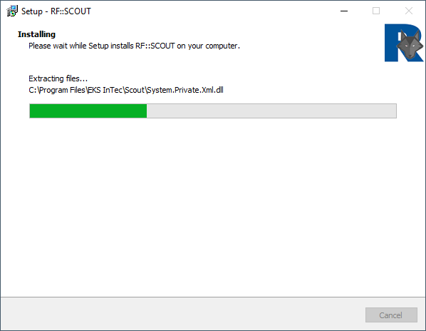

### Installation Microsoft Edge WebView2 Runtime
Die Anwendung RF::SCOUT benötigt den Edge WebView2 Runtime von Microsoft. Im installations Prozess wird geprüft ob der Edge WebView2 Runtime auf dem Gerät installiert ist und gegebenenfalls wird diese Mitinstalliert. Diese Prüfung kann auch im Hintergrund angestoßen worden sein und der Benutzer bekommt die Prüfung und installation von Edge WebView2 Runtime nicht mit.

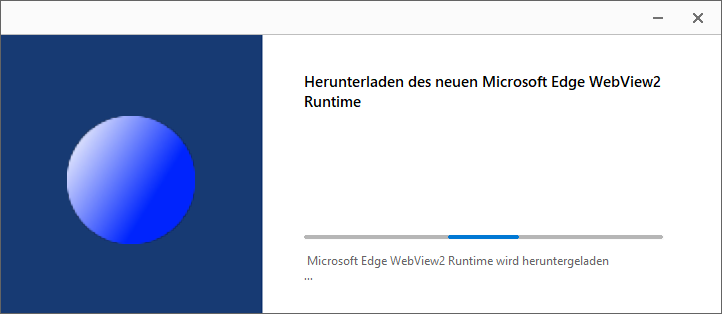

1. Wenn Microsoft Edge WebView2 Runtime vorhanden ist, wird eine Information[^1] ausgegeben:

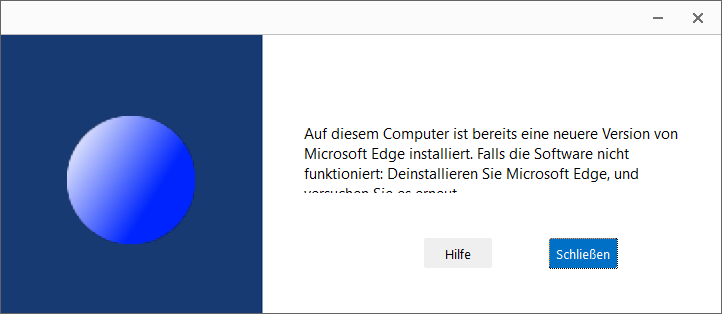

1. Wenn Microsoft Edge WebView2 Runtime nicht vorhanden, wird diese Anwendung installiert und bei erfolg die Information ausgegeben:

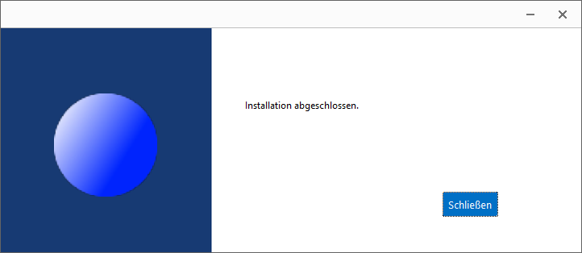

[^1]: In dem Informationsfenster steht die Anwendung "Microsoft Edge" dies ist nicht richtig, da es nicht "Edge" von Microsoft ist sondern "Edge WebView2 Runtime".

### Completing
Installations Fertigstellungsanzeige mit der Möglichkeit bzw. Auswahl RF::SCOUT direkt zu starten.

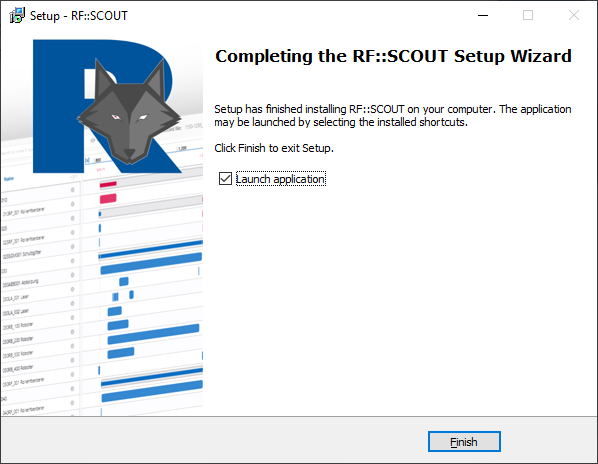

### Start
Ist die Installation korrekt gelaufen kann die Anwendung RF::SCOUT gestartet werden.

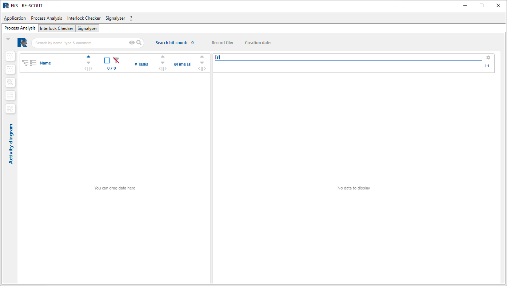

---

## Fehlermeldungen
Folgende Fehlermeldungen können wärend der Installation und dem Start von RF::SCOUT auftreten.

### Installation
Nachfolgend die Fehlermeldungen die bei einer Installation auftreten können.
#### Doppelte Installation
Diese Fehlermeldung erscheint wenn der Installationsprozess ein zweites Mal ausgeführt wird obwohl der erste noch nicht beendet wurde.

- Den zweiten Installationsprozess mit dem "OK" Button beenden.

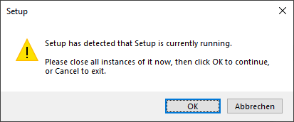

#### Anwendung läuft im Hintergrund
Diese Fehlermeldung erscheint wenn eine RF::SCOUT Anwendung wärend der Installation geöffnet ist.

- Die Daten in den angezeigten Anwendungen speichern und den Installationsprozess mit _Automatically close the applications_ fortführen.

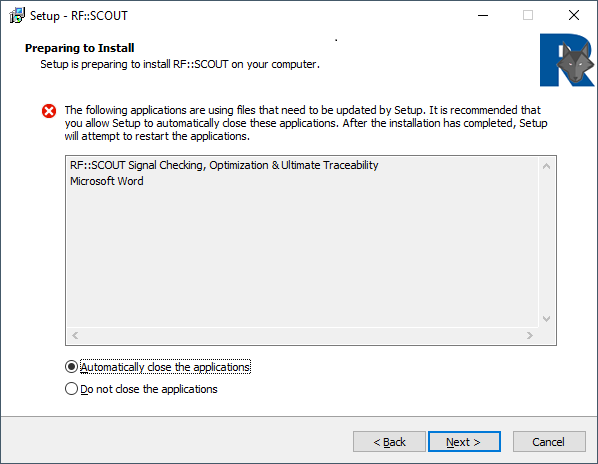

Wird RF::SCOUT nicht beendet und der Installationsprozess mit _Do not close the applications_ fortgeführt oder wird wärend des Installationsprozess RF::SCOUT gestartet, stoppt die Installation, da zu installierenden Dateien von RF::SCOUT im Zugriff sind.

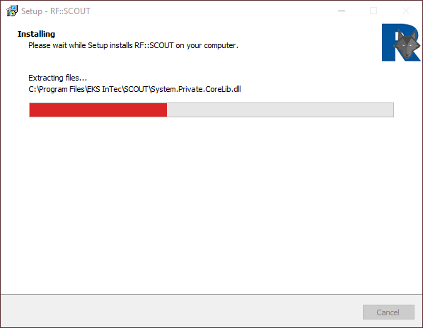

Es erscheint zudem die Meldung

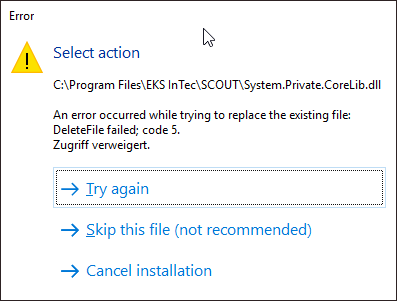

Ein _Cancel installation_ ist zwar möglich aber der Rollback löscht Programmteile von RF::SCOUT und die Anwendung ist dann nicht mehr funktionsfähig. Siehe hierzu [Missing Files](#missing-files).

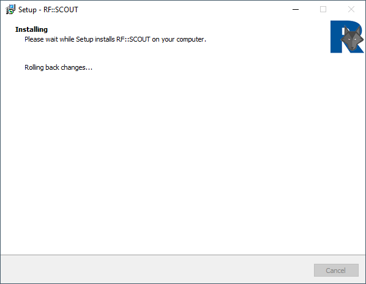

### Anwendungsstart
Nachfolgend die Fehlermeldungen die nach oder wärend des Starts von RF::SCOUT auftreten können.
#### Missing Microsoft Edge WebView2 Runtime
Die Anwendung RF::SCOUT findet die Anwendung Microsoft Edge WebView2 Runtime nicht.

- Installationsprozedur nochmals starten.
- Nachinstallation der Edge WebView2 Runtime Anwendung mit dem "Ja" Button der Meldung.

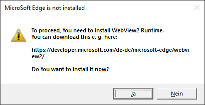

#### Missing License
Es ist keine Lizenz vorhanden bzw. die Lizenz wird von RF::SCOUT nicht erkannt.

- Lizenz beantragen.
- Dongle prüfen.

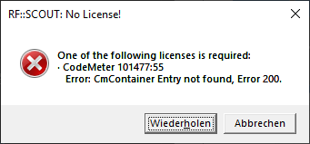

#### Missing Files
Die Anwendung RF::SCOUT findet Dateien nicht und startet inkorrekt

- Installationsprozedur nochmals starten.

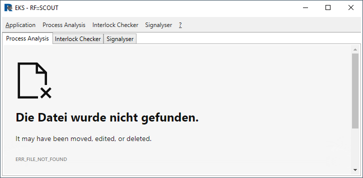