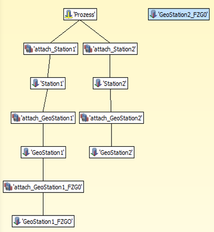
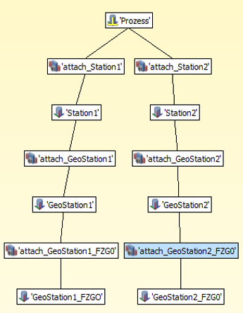
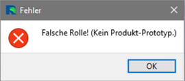

# RF::YAMS Tips & Tricks

## Verbindungen

Jeder Körper/Bahn in RF::YAMS, muss über eine Verbindung mit einem statischen Körper verbunden sein. Wurde ein Körper beim Importieren oder beim nachträglichen Hinzufügen in das RF::YAMS Projekt nicht mit einem statischen Körper verbunden, kann dies dazu führen, dass sich Achsen nicht bewegen, Bauteile im Materialfluss nicht um referenziert werden, Werkzeuge nicht an-/abgedockt werden oder die Resourcen auf der Förderstrecke sich nicht bewegen. 
Beim Importieren der RF::YAMS Daten wird immer der oberste Körper als statisch markiert. Zu diesem Körper muss jeder weitere Körper in RF::YAMS eine Verbindung aufweisen. Ein RF::YAMS Projekt kann auch mehrere statische Körper haben.

_Abbildung 1: Statischer Körper. Dieser kann sich nicht bewegen und alle Bewegungen werden von diesem Punkt aus berechnet._

_Abbildung 2: Korrekter kinematischer aufbau nach Import der Daten in RF::YAMS._

_Abbildung 3: Neu hinzugefügter Körper, welcher lose im Projekt liegt und noch keine kinematische Beziehung zu einem anderen Körper oder Bahn aufweist._

_Abbildung 4: Neu hinzugefügter Körper, welcher im Projekt mit einem bestehenden Körper über eine lose Verbindung kimenatisch verbunden wurde._

## Materialfluss - Produkte

Für den Materialfluss in RF::YAMS können ausschließlich Körper, welche im Reiter Produkt hinterlegt sind als Produkte verwendet werden. Ebenfalls können nur Ressourcen als Referenzpunkt für Puffer im Materialfluss verwendet werden. Es ist jederzeit möglich, die Körper in den anderen Reiter zu kopiert oder zu verschieben.

_Abbildung 5: Fehlermeldung falsche Rolle des Körpers._

Diese Meldung wird von RF::YAMS ausgegeben, wenn ein Körper als Bauteil verwendet wurde, welcher nicht im Reiter Produkt einsortiert ist und dadurch nicht die Rolle „Produkt“ hat.
Dies kann vorkommen, wenn das Ausgewählte Produkt im Reiter Produkt einsortiert ist aber es eine kinematische Verbindung zu einem Körper im Ressourcenbaum gibt.
In diesem Beispiel ist Kinematisch alles richtig aufgebaut allerdings befindet sich der Körper „Product1b“ im Ressourcenbaum.
Wird nun ein Bauteil in der Simulation erzeugt, möchte RF::YAMS das Bauteil mit all seinen verbunden Körpern kopieren. Dadurch dass sich aber ein Körper in dem Ressourcenbaum befindet, wird folgender Fehler ausgegeben.
Lösung: Körper vom Ressourcenbaum in den Produktbaum verschieben.
